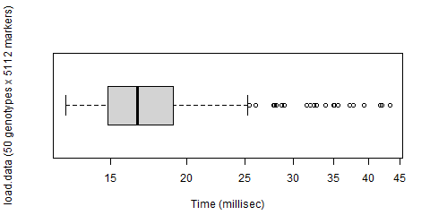
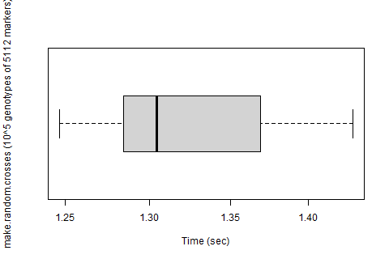
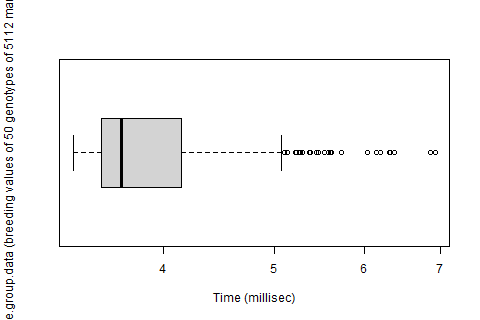

```{r, include = FALSE}
knitr::opts_chunk$set(
  collapse = TRUE,
  comment = "#>"
)
```

**Significant changes in v0.2.5**:

- As part of efforts to increase naming consistency between R and C versions of the package, some R functions have changed names. The old function names still work, but may become deprecated at some point in future.

| Old name | New (recommended) name |
|:-----    | :----- |
| see.minimum.GEBV | see.minimal.GEBV |
| select.by.gebv | break.group.by.GEBV |
| make.group.from.label | break.group.by.label.value |
| make.group.from.label.range | break.group.by.label.range |
| make.label | create.new.label |
| load.more.genotypes | load.genotypes | 
| load.different.effects | load.effects |
| cross.randomly | make.random.crosses |
| cross.randomly.between | make.random.crosses.between |
| cross.combinations | make.targeted.crosses |
| cross.combinations.file | make.crosses.from.file |
| cross.dc.combinations.file | make.double.crosses.from.file |
| cross.all.pairs | make.all.unidirectional.crosses |
| save.local.GEBVs.by.file | save.local.GEBVs.blocks.from.file |
| save.local.GEBVs.by.chr | save.local.GEBVs.blocks.from.chrsplit |
	
See package's NEWS.md file for more detail and other changes.

```{r setup}
library(genomicSimulation)
```

# Introduction
genomicSimulation is a simple, fast scripting simulation tool for creating 'digital twins' of breeding schemes. The package tracks genotypes at an individual level, and performs stochastic simulation of diploid meiosis (including crossing-over but not mutation) to simulate crossing.

All core functionality is written in C. Performing the computation-intensive tasks at C-level allows for quick runtimes. However, this means the simulated data will not be visible to R until explicitly pulled into R's environment by one of the commands provided for this purpose.

Contact the package maintainers at https://github.com/vllrs/genomicSimulation/ for any feature requests or improvement requests, or to report any bug or crash. 

Guides on using the package can be found in sections 4 and 5 of this vignette.

[A formal summary of this tool's design and performance is available on bioRxiv. Some information (capabilities, function names) may be out of date.](https://www.biorxiv.org/content/10.1101/2021.12.12.472291v2)

## Getting to know genomicSimulation

genomicSimulation exists as a set of scripting functions at R-level (like `load.genotypes`, `make.random.crosses`, and `see.optimal.haplotype`) plus an invisible table containing the simulation's currently-active data.

Because it was initially created for simulating plant breeding programs, the package does not automatically track sex.

Broadly speaking, the tool provides three main categories of simulation functions:

- creating more genotypes, 
- selecting between genotypes,
- and reorganising/recategorising genotypes. 

Simulation functions can be used in any order and interspersed in any way. The only fixed requirement of a valid genomicSimulation script is that the first command is `load.data()`, which initialises the invisible table and loads the list of tracked genetic markers.  

In genomicSimulation, every genotype is a member of a 'group', an abstract category represented by a number. A genotype only belongs to one group at a time, but it can be moved between groups with great flexibility. Selection is simulated by pulling selected genotypes into a new group. Most crossing actions are performed by crossing a group's members to each other, or performing crosses between members of two different groups. Groups can be combined, split randomly, or split along specific lines. Groups can be deleted to destroy the genotypes they contain. 

Using these two factors (all genotypes being allocated to reconfigurable groups, and simulation actions being able to be undertaken in any order) genomicSimulation has the flexibility to simulate a huge range of breeding programs. You can imagine repeatedly simulating crosses from a 'breeding pool' group and discarding all but a selected subset of offspring which can be merged back into the breeding pool, or simulating a nucleus breeding system with several funneled breeding pools running simultaneously, each replenished by the best offspring of their own pool and whatever trickles down from more elite pools, or simulating a breeding program with concurrent population development/improvement streams which splits off copies of certain genotypes to repeatedly self into homozygosity for commercialisation testing.

As an R user, the functions `see.existing.groups()`, `see.group.data()`, and `see.group.gene.data()` are the easiest ways to access your simulation data. Other output formats are available via saving data to files.


# Package Details
## Input Files

The package's first command, used to set up or to reset the simulation, is `load.data`. This command takes up to three input files as parameters: a genotype matrix, a genetic map, and a list of marker effects. The latter, the list of marker effects, is optional. If no genetic map is provided, the genetic markers listed in the genotype matrix will be assumed to be evenly spaced along a single chromsome in the order that they are presented in the genotype matrix.

### Genetic map files

The simplest genetic map file is formatted as follows:
```
marker chr pos
m3 3 15
m2 1 8.3
m1 1 5.2
```
Other valid genetic map files might include:
```
chr marker pos
1A 1243509 173.2
1A 2350898 462.2
1B 4360992 32.009
2A 1243556 243.5
```
or
```
gene 10 3.24
othergene 10 8.3e-1
etc 15 1.203e2
```

The header line is optional. If there is a header line, the three columns "marker" "chr" and "pos" may be rearranged into any ordering. If the header is not provided, the order is assumed to be marker name in the first column, followed by chromosome in the second column, followed by position in the third.

Regarding marker names: For all genomicSimulation features to work, genetic markers must have names. There is no issue with purely numeric names.

Regarding chromosomes/linkage group: any alphanumeric combination may be used to denote a chromosome/linkage group, for example '9' or '1A'. There is no limit on the number of unique chromosomes/linkage groups in the map.

Regarding marker position: this represents the position in centimorgans of each marker along its linkage group. (Distance of 1 cM = expected probability of 0.01 chromosomal crossovers in that range.)

The cells in the map file may be separated by spaces, tabs, commas, or any combination thereof. Cell spacers do not need to be consistent across the file, but therefore marker names/linkage group names cannot contain spaces, tabs, or commas. 

The order in which genetic markers are presented in the file does not matter. If a marker is duplicated in the file, it will be recorded twice as two separate markers in the same position and with the same name.  However, because loading genotypes depends on searching for markers by name, if two markers have the same name, genotypes may not be loaded correctly. Therefore it is suggested that all markers have unique names.

### Genotype matrix files

The simplest genotype matrix file is formatted as follows:
```
name	G01	G02	G03	G04	G05	G06
m1	TT	TT	TT	TA	TT	AT
m3	TT	TT	TA	TA	TT	TT
m2	AA	AA	AA	AA	CC	AA
```
where G01, G02, ..., are names of the founder genotypes; m1, m2, ..., are the genetic markers; and entries in the matrix are the alleles that the founder genotypes have at those markers. 

Other valid genotype matrix files might include:
```
 m100, m101, m102
cand1,0,0,1
cand2,1,2,2
cand4,2,1,2
```
or
```
marker1	T/T	T/T	T/T	T/A	T/T	A/T
marker3	T/T	T/T	T/A	T/A	T/T	T/T
marker2	A/A	A/A	A/A	A/A	T/T	A/A
```

The genotype matrix can be row-major or column-major (that is, the genetic markers may be rows, or columns). The program will determine the orientation by attempting to match row and column headers with names of markers tracked by the simulation (extracted from a genetic map file). If the simulation does not yet have a list of tracked markers (that is, no genetic map has been simultaneously or previously provided), then it defaults to assuming that rows represent genetic markers.  

The order in which genetic markers are presented in the file does not matter. Candidate genotypes, however, will be saved internally in the simulation in the order that they appear in the file. Candidate genotype names do not need to be unique. Candidate genotype names are optional, if candidates are stored as columns. genomicSimulation cannot read a gentoype matrix with no row headers, so if candidates are stored as rows, then they are required to have names.

Genetic markers' names are required. 

When there are both row and column headers, the first/corner cell (the one that contained the value "name" in the first example above) can be deleted or can contain any text. Its value will be ignored. 

The table cells in the genotype matrix file may be separated by spaces, tabs, commas, or any combination thereof. Cell spacers do not need to be consistent across the file. 

There are several options for how the alleles at each marker can be presented. All allele pair cells in the same genotype matrix must be in the same format. The format of the allele pairs in the genotype matrix is automatically detected. There are four acceptable formats for allele pairs in the genotype matrix:

1. Any pair of characters (eg. "AA", "TA", "nW"). Each character is an allele. This is a format that specifies allele phase (ie. "AT" and "TA" are different genotypes).
2. Any pair of characters, separated by a forwards slash "/" character (eg. "A/A", "T/A", "n/W"). The two characters either side of the slash are the alleles. This is a format that specifies allele phase (ie. "AT" and "TA" are different genotypes).
3. Alternate allele counts ("0", "1", "2"). This is a format that does not specify allele phase, so phase of heterozygotes will be randomised when loaded. The counts represent the number of copies of the alternate allele (stored inside genomicSimulation as "A", while the reference allele is stored as "T"). "0" then corresponds to "TT", "2" to "AA", and "1" will be randomised as either "TA" or "AT". Corresponding marker effect files for calculating breeding values must use allele "A" consistently to represent the alternate allele, and "T" to represent the reference. (alternatively, `change.allele.symbol` can be used after loading to change T and/or A to other symbols.)
4. (subset of) IUPAC encodings of DNA bases ("G", "A", "T", "C", "R", "Y", "M", "K", "S", "W", "N"). This is a format that does not specify allele phase, so phase of heterozygotes will be randomised when loaded. See below for meanings of the IUPAC encoding symbols that genomicSimulation can parse.

```{r table1, echo=FALSE, message=FALSE, warnings=FALSE, results='asis'}
tabl <- "
| IUPAC symbol  | genomicSimulation genotype |
|---------------|---------------|
| G | GG |
| A | AA |
| T | TT |
| C | CC |
| R | GA or AG |
| Y | TC or CT |
| M | AC or CA |
| K | GT or TG |
| S | GC or CG |
| W | AT or TA |
| N | \\0\\0 (nulls represent unknown genotype) |
"
cat(tabl)
```

**Note you might have a genotype matrix of only "AA", "AT", and "TT". This uses "alternate allele counts"-style encoding (like format 3) but presents it in a format that looks like pairs of alleles (format 1).** genomicSimulation expects allele pair encodings to include haplotype phase, (that is, to have four possible values for genotypes of two alleles, not three: eg. "AA", "AT", "TA", and "TT" instead of just "AA", "AT", "TT"). 

Two options for loading a dataset with non-phased "AA"/"AT"/"TT" allele pairs are:

- Use “haplotyping”/”haplotype phasing”/”haplotype inference” software to infer whether heterozygotes are "AT" or "TA", before loading into genomicSimulation.
- Find-and-replace "TT" with "0", "AT" with "1", and "AA" with "2" before loading into genomicSimulation. genomicSimulation will then randomise the phase of each haplotype.


### Marker effect files

Loading marker effect file(s) is optional for running the simulation. The simplest marker effect file is formatted as follows:
```
marker allele eff
m1 A -0.8
m2 A -0.1
m3 A 0.1
m1 T 0.9
m3 T -0.1
```
Other valid marker effect files might include:
```
marker eff allele
m1243509 0.1 A
m1243509 -0.1 T
m2350898 0.15 T
m2350898 -0.1 A
```
or
```
specialgene G 1.0
```

A single marker effect file represents the allele effects for one trait. Multiple files like this can be loaded in order to calculate breeding values for multiple traits separately.

The header line is optional. If there is a header line, the three columns "marker" "allele" and "eff" may be rearranged into any ordering. If the header is not provided, the order is assumed to be marker name in the first column, followed by allele, followed by additive effect value.

The order of the rows in the file does not matter. If multiple rows exist in the file for the same marker name/allele combination, only the last row's additive effect value will be saved. 

Regarding marker names: Only rows in this file whose marker name matches a marker name from a previously- or simultaneously-loaded map file or genotype matrix file will be loaded. 

Regarding allele: This column should be the allele (non-space character, eg "A") that this effect value corresponds to. 

Regarding allele effect: This column should be a decimal representing the additive effect value of the same-row allele for the same-row marker. It can be positive or negative or zero, and can be represented by an integer, a decimal, or scientific notation. 

Cells may be separated by spaces, tabs, commas, or any combination thereof. Cell spacers do not need to be consistent across the file. 

### Incorrect file format detection
By default, genomicSimulation attempts to detect the format of input files as it loads them. When a file loading command is run, genomicSimulation prints out its assumptions about the format of the file.

If the printed logs are incorrect about the layout of your map file or effect file, the most likely cause is a mis-spelling in the header row of the file. If the printed logs are incorrect about the size of the table in your map file or effect file, the issue may be that the numbers cannot be detected as numbers, or that there are issues with the column spacers/line breaks that cause there to be more than three entries to a row.

If the printed logs are incorrect about the layout or format of your genotype matrix file, you can manually specify the file format for genomicSimulation, using the function `define.matrix.format.details`. It is not required that you manually specify all details of the file format. Whatever details of the file format are not manually specified will be automatically detected.

### Loading from other file formats
Updates to expand the range of allowed input formats are in development.


## The invisible table
The package has an internal invisible table (called `SimData`) where it stores simulated genotypes and other details. An external pointer to `SimData` is saved in a package-global R variable called `sim.data$p`. `sim.data$p` is hidden during regular use, and attempting to access the C-level data via the external pointer is not advised. All user-facing functions in the C library have R interfaces provided.

To reset the simulation/clear it of all data, the function `clear.simdata` is provided. Currently the R version does not have functionality for having two concurrent simulation states in the same R session. `load.data` also resets/clears the old simulation before setting up a new one.

### Markers
The foundation of the `SimData` (that is, the only detail that cannot be changed without clearing the invisible table) is the list of genetic markers present in the map file passed to `load.data` (or the genotype file, if no map file was given), when setting up this instance of the simulation. Only these markers will be tracked in simulation, even if later genotypes/maps/marker effects loaded mention other markers. 

Because the `SimData` stores its markers in genome order, any outputs produced will have the markers ordered according to the genetic map loaded at its creation. If an output method provides genotypes as strings of alleles, the string will also be ordered according to this genetic map.

Further genetic maps can be loaded with `load.map`. Secondary genetic maps can be used to simulate meiosis, allowing for, for example, simulating different crossover rates and patterns between sexes.

Note that genomicSimulation does not care what potential values/alleles the marker can take. Any 8-bit non-space character will be accepted as an allele. This means SNP markers can be represented with the two alleles 0 and 1, or A and T, etc., according to your preference. On the other end of the spectrum, a marker could also represent an abstracted Mendelian gene with alleles A, a, t, +, and o. 

### Effects
The simulation calculates genetic breeding values for an arbitrary trait using an additive model.

While the simulation cannot run without a genetic map, it will happily run without effect values. There is no need to provide effect values if genetic breeding values are not to be used. If they are to be used, the simulation can load an effect file containing the additive effect of having a given allele at a given marker (see Indexes: Input File Formats: Effect files). The genetic breeding values are then calculated by adding up the effects of each allele in the genotype for which there is an effect loaded (that is, markers and alleles not mentioned in the effect file contribute nothing to the score).

Additional sets of marker effects can be loaded in with `load.effects`. Each set of marker effects will have a numeric identifier (sequential natural numbers starting at 1), which is presented to the user as the return value from the function that loaded that effect file. All breeding value calculations will, by default, use the first loaded set of marker effects. The numeric identifier of a different set of marker effects can be passed to the `eff.set` parameter of these functions to use that marker effect set instead.

### Genotypes
Each genotype/line may or may not be given a name. Generating names for simulated genotypes can be turned on in the common crossing settings (see Indexes: Crossing Function Settings). 

You will likely want to load at least one genotype before starting simulation operations. genomicSimulation has no genome-construction or mutation mechanisms: there is no other way to get your simulation population started! At any point in simulation more genotypes can be imported from files using the function `load.genotypes`.

## Understanding Groups
As far as genomicSimulation is concerned, every genotype always exists as a member of a group. Genotypes loaded from the same file are automatically allocated to the same group. Every crossing function also places the genotypes it produces in a new group. Each group is denoted by a group number.

A genotype can only belong to one group, so functions that overwrite allocations (eg `make.group`) effectively pull genotypes out of their old group and put them into the new one. This ensures that each genotype can only be deleted once.

Group numbers are positive whole number starting at 1. Group numbers are not guaranteed to be allocated sequentially, because some crossing functions may create and delete temporary groups to carry out their task, so the final group number could be 'out of order'. Group numbers may be re-used within the same simulation, when the previous group that was identified by that number is empty.

The group numbers of groups created or modified by a function call will be given in the return value of the function. In your R environment, the groups you are working with and modifying with genomicSimulation functions will be functionally just integers. Note that only genomicSimulation functions can actually make changes to the groups. Modifying the numbers returned by genomicSimulation in the R environment will have no effect, and furthermore genomicSimulation will not, for example, delete a number in the R environment if that group ceases to exist (or vice-versa, a group will not disappear from the R environment when it is deleted inside genomicSimulation).

## Understanding Custom Labels

Sometimes you might have reason to want to track extra details about your genotypes (a common use case would be the age or sex of the simulated individual), or you might want a categorisation system that persists even when groups are broken apart, dissolved, and/or reformed while performing particular selection or mating procedures.

A custom label is an attribute or field with a value for each individual in simulation. The values of a custom label are stable until changed by the user. genomicSimulation gives its users the power to create as many labels as desired, to set default values for each label, and to change the value of the label on each simulated individual.

Every genotype in the simulation will hold some value in every label that exists. Specifically, the values of the labels must be integers (whole numbers). Interpretation of the labels (e.g. age in months; year of birth; phenotype), is up to the user to keep track of: genomicSimulation only knows the ID of each label, and the values of that label for every simulated individual.

Like group numbers, label IDs are integers greater than 0. The function `create.new.label` returns the label ID of the label it just created. This is an exception to the usual rule that functions return the group number of the group that was created, or 0 if they did not create a new group. Label manipulation functions like `change.label.by.amount` do follow the pattern and return 0, since they do not create a new group. 

Also like groups, use `delete.label` to delete a custom label (all simulated individuals will still exist, but they will no longer have any value under the custom label that no longer exists). Merely removing the label ID from the R environment does nothing to remove the label from simulation memory.

## Understanding Identifiers
There are six categories of identifiers that may be observed during use of the simulation. The same number as an identifier may represent different things. Eg. Group 1 is not intertwined or associated with Custom label 1. 

1. *Group numbers/group IDs*, which were discussed in the preceding section on groups. They are whole numbers starting at 1. They define a set/group of genotypes/candidate lines. Once a group is deleted via `delete.group` or made empty by other methods (eg. `make.group`), its ID may be reused for a nother group created in future.
1. *Label IDs*, which were discussed in the preceding section on labels. Like group numbers, they are whole numbers starting at 1. They define a particular custom label (the user may create as many custom labels as are needed). A label keeps its same identifier for its lifetime, even when its values are changed. Once a label is deleted via `delete.label`, its ID may be reused.
1. *Recombination Map IDs*, which represent a particular genetic map/linkage map loaded in `load.data` or `load.map`. Like group numbers and label IDs, these identifiers are whole numbers starting at 1. A recombination map keeps its same identifier for its lifetime in the simulation (though, if you load the same recombination map multiple times, there could be multiple identical maps in the simulation.) Once a map is deleted via `delete.recombination.map`, its ID may be reused.
1. *Effect Set IDs*, which represent a particular set of additive marker effects to be used for calculating breeding values. Each set of effects represents marker effects loaded from a single file in `load.data` or `load.effects`. Like group numbers and label IDs, these identifiers are whole numbers starting at 1. A marker effect set keeps its same identifier for its lifetime in the simulation (though, if you load the same effect file multiple times, there could be multiple identical marker effect sets in the simulation). Once a set of marker effects is deleted via `delete.effect.set`, its ID may be reused).
1. *Genotype Pedigree IDs*. These are whole numbers starting at 1 that are unique to a particular genotype/candidate line for the lifetime of the simulation object. IDs are used for tracking pedigree. During crossing, the allocation of pedigree IDs can optionally be turned off.
1. *Genotype/Candidate Indexes*. These represent the position/column number in the invisible table at which a genotype/candidate line is stored. They are therefore unique to the genotype but may change over the lifetime of the simulation (because when genotypes/columns are deleted, the column numbers of the remaining genotypes may change). Because, unlike pedigree IDs, every genotype is guaranteed to have an index, functions like `make.group` and `make.targeted.crosses` that act on specific genotypes (rather than groups) generally take indexes as inputs. Since indexes can change, however, it is important to not place a `delete.group` call between getting index data (`see.group.data` with data type "X") and using indexes in one of these function calls.

The return values of nearly every function in the package (excluding the functions that pull data into R, whose names begin with `see.`) are vectors of integers representing one of the first four identifiers, above. If the function is `make.label`, it returns the new label's ID. If the function is `load.effects`, it returns the marker effect set ID from the provided effect file's set of marker effects. If the function is `load.map`, it returns the identifier for the recombination map just loaded. 

Most commonly, if the function created or modified groups, the return value(s) are the group number(s) of the group(s) created or modified. If the function returns 0, then it succeeded but did not change any groups.

## Understanding Output Methods
There are three sets of functions to get output from the simulation. The third is the most recommended, as it is the easiest to use within the R environment. 

1. Calling a `save.`-prefixed function, to save data to a file. These can be called on any group or on the entire simulation, and offer a range of data types, each which has a few possible output format (see [Indexes: Output File Formats](#output-file-formats)).
2. Saving the data about a cross at the same time as producing it (`save`-prefixed parameters in crossing functions, see [Indexes: Crossing Function Settings](#crossing-function-settings)). This enables more compact data saving, and also would allow for simulating more crosses than can be stored in system working memory (by setting the parameter `retain=FALSE`). In this save-as-you-go saving, the simulation generates and saves crosses in batches of 1000. save-as-you-go is however less flexible than `save.`-prefixed functions because only the default printing format is used and only the genotypes produced by one particular crossing call are saved.
3. The `see.`-prefixed functions, to pull data into R. The custom selection method interface in R is designed to work with these functions (see [Workflow: Writing Custom Selection Methods in R](#writing-custom-selection-methods-in-r)). 


# Speed

genomicSimulation makes no attempts to parallelise execution.

Three benchmarks of three frequently-used features of the package are presented. Benchmarking was performed using R package [microbenchmark](https://doi.org/10.32614/CRAN.package.microbenchmark) on genomicSimulation version v0.2.5.007. Benchmarking was not performed in an isolated testing environment.

## Set up simulation founders 
```{r table2, echo=FALSE, message=FALSE, warnings=FALSE, results='asis'}
tabl <- "
| Test Details  |  |
|---------------|---------------|
| R version     | R 4.3.1, running in RStudio       |
| Device        | Laptop, 16GB RAM, 11th Gen Intel i7 CPU, running Windows 11 |
| N replications | 500 |
| genomicSimulation command | load.data |
| Input size | 50 founder lines genotyped across a 5112-marker map | 
"
cat(tabl) # output the table in a format good for HTML/PDF/docx conversion
# Thanks https://stackoverflow.com/questions/19997242/simple-manual-rmarkdown-tables-that-look-good-in-html-pdf-and-docx
```

**Min:** 0.0126 seconds 
**Mean:** 0.0176 seconds 
**Max:** 0.0434 seconds 



## Simulate crossing
```{r table3, echo=FALSE, message=FALSE, warnings=FALSE, results='asis'}
tabl <- "
| Test Details  |  |
|---------------|---------------|
| R version     | R 4.3.1, running in RStudio       |
| Device        | Laptop, 16GB RAM, 11th Gen Intel i7 CPU, running Windows 11 |
| N replications | 100 |
| genomicSimulation command | make.random.crosses |
| Input size | 50 founder lines genotyped across a 5112-marker map | 
| N crosses simulated | 10^5 |
"
cat(tabl)
```

**Min:** 1.25 seconds 
**Mean:** 1.32 seconds 
**Max:** 1.43 seconds 



## Calculate breeding values
```{r table4, echo=FALSE, message=FALSE, warnings=FALSE, results='asis'}
tabl <- "
| Test Details  |  |
|---------------|---------------|
| R version     | R 4.3.1, running in RStudio       |
| Device        | Laptop, 16GB RAM, 11th Gen Intel i7 CPU, running Windows 11 |
| N replications | 500 |
| genomicSimulation command | see.group.data(,\"B\") |
| Input size | 50 founder lines genotyped across a 5112-marker map | 
"
cat(tabl)
```

**Min:** 0.00333 seconds 
**Mean:** 0.00393 seconds 
**Max:** 0.00692 seconds 



Forms of output that involve writing to files will be slower than methods of output that involve extracting data to the R environment. 


# Workflow
Sample scripts for simulating common scenarios using genomicSimulation are provided on [this Templates page](https://vllrs.github.io/genomicSimulationC/html/templates.html).

A simple workflow for this package could be:

1. Load progenitor lines and SNP data; save the group number of the progenitor lines. (The effect values for calculating breeding values for a desired trait can be loaded here too, if desired). Suggested function: `load.data`
1. Perform crossing from the progenitor group. Keep a hold of the group number of these crosses. Example function: `make.random.crosses`
1. Perform selection on the F1 generation generated above. Example function: `break.group.by.GEBV`
1. Perform more crossing from the F1 generation (using the group number from the above step).
1. Repeat for further generations.
1. Save the final genotypes (and/or effect values and/or pedigrees) to files. Example function: `save.genotypes`

The example below shows a how a typical workflow might save group numbers and call crossing functions.
```{R}
# (Show the tiny example data set)
read.csv("../tests/testthat/helper_genotypes.txt", sep='\t', header=T)
read.csv("../tests/testthat/helper_map.txt", sep='\t', header=T)
read.csv("../tests/testthat/helper_eff.txt", sep='\t')

# Starting to use genomicSimulation: load the small initial data set
init <- load.data("../tests/testthat/helper_genotypes.txt",
                "../tests/testthat/helper_map.txt",
                "../tests/testthat/helper_eff.txt")
g0 <- init$groupNum
# The other entries of the list 'init' are:
# map1 <- init$mapID #, the identifier of the genetic map loaded
# eff1 <- init$effectID #, the identifier of the effect file loaded

# Do random crosses from the progenitor lines. 
f1 <- make.random.crosses(g0, n.crosses=20, give.names=TRUE, name.prefix="F1.")

# Find the 25% with the top breeding value/GEBV
f1.selected <- break.group.by.GEBV(f1, percentage=25)

# Delete groups we are not currently using, to free up some memory.
delete.group(f1)

# Make 40 random crosses from those selected 25%
f2 <- make.random.crosses(f1.selected, n.crosses=5)
delete.group(f1.selected)

# Complete 4 rounds of selfing with save-as-you-go genotype saving
f6 <- self.n.times(f2, 4, file.prefix="af6", save.genotype=TRUE)

# Show current state of groups.
see.existing.groups()

# (These are the groups the above command should show)
print(c(g0, f2, f6))

# Show the save-as-you-go output file
read.csv("af6-genotype.txt", sep='\t')


# (cleanup)
file.remove("a.txt")
file.remove("b.txt")
file.remove("af6-genotype.txt")
```

## Tracking Sex of Genotypes

The above example, while not very realistic, was clearly inspired by plant breeding methods: four generations of selfing to produce a homozygous inbred for bulking and commercial release is not a usual strategy in animal breeding. Perhaps a key aspect in which animal breeding programs differ from a self-pollinated plant breeding program is that you can't cross just any animal with any other animal. That is referring, in part, to the higher importance of avoiding inbreeding, but mostly to the fact that animals come in male and female varieties.

genomicSimulation does not track sex of genotypes. The group system can however be used to that effect.

```{R}
# Starting to use genomicSimulation: load the small initial data set
init <- load.data("../tests/testthat/helper_genotypes.txt",
                "../tests/testthat/helper_map.txt",
                "../tests/testthat/helper_eff.txt")
cows <- init$groupNum
# Load the small initial data set again, pretending this represents a different set of genotypes
bulls <- load.genotypes("../tests/testthat/helper_genotypes.txt") 

# Create some offspring
f1 <- make.random.crosses.between(cows, bulls, n.crosses=5)

# Simulate the sex of offspring
temporary <- break.group.randomly(f1, into.n=2)
calvesF <- temporary[1]; calvesM <- temporary[2]; rm(temporary);

#... and so forth
```

Alternatively, a custom label could be used to track sex:

```{R}
# Starting to use genomicSimulation: load the small initial data set
init <- load.data("../tests/testthat/helper_genotypes.txt",
                "../tests/testthat/helper_map.txt",
                "../tests/testthat/helper_eff.txt")
cows <- init$groupNum
# Load the small initial data set again, pretending this represents a different set of genotypes
bulls <- load.genotypes("../tests/testthat/helper_genotypes.txt") 

# Define our interpretation of the custom label
FEMALE <- 1L
MALE <- 2L
# Create the label
sexLabel <- make.label(default=FEMALE)
change.label.to.this(sexLabel, MALE, group=bulls)

# Create some offspring
f1 <- make.random.crosses.between(cows, bulls, n.crosses=5)

# Simulate the sex of offspring
change.label.to.values(sexLabel, values=c(sample(c(FEMALE,MALE), size=5, replace=TRUE)), group=f1)

# Then split up your calves as needed
calvesF <- break.group.by.label.value(sexLabel, FEMALE, group=f1)
calvesM <- f1 #the calves left in F1 must be all the males

#... and so on
```


## Writing Custom Selection Methods in R
Inbuilt selection methods in genomicSimulation have the prefix `break.group.` (eg `break.group.by.gebv`, `break.group.by.label.value`). However, custom selection methods can be written using the `make.group` function, which takes an arbitrary set of genotype indexes and moves them out of their old groups to form a new group. Indexes of genotypes can be accessed via `see.group.data` with data type parameter `X`.

For an example, consider that a user wants to implement a custom selection method that selects the top 10 simulated crosses by phenotype. Because genomicSimulation offers no internal method for simulating phenotypes, the user must simulate phenotypes in R, then use the custom selection method interface to perform their selection.

Suppose the user chooses the following model for their simulated phenotype: $P = G + E$. The phenotypic values $P$ will be made equal to the breeding value genomicSimulation calculates ($G$) plus a value for environmental contribution ($E$) drawn from a normally distributed distribution with variance $V_e$, where $V_e$ comes from the equation $H^2 = V_g/(V_g + V_e)$.

For ease of simulation, $H^2$ is a known broad-sense heritability estimate for the trait, and $V_g$ is the variation in breeding values among the candidate genotypes from which they are selecting. Therefore, this approach uses the following steps to simulate phenotypes: 
1. calculate the magnitude of $V_e$ using the set of breeding values from the crosses on which selection is being performed
2. draw from a normal distribution to get simulated phenotypes

The user creates the following R function to perform their selection:

```{R}
get.top.10.phenotypes <- function(group, heritability) {
  info <- data.frame(Index=see.group.data(group,"X"),
                     GEBV=see.group.data(group,"BV"))
  
  # simulate phenotype = genotype + environmental variation
  # using normally distributed Ve and heritability H^2 = (Ve + Vg)/Vg
  Vg <- var(info$GEBV)
  Ve <- Vg/heritability - Vg
  info$Pheno <- info$GEBV + rnorm(length(info$GEBV), mean=0, sd = sqrt(Ve))
  
  # Select those with the top phenotype
  return( info[order(info$Pheno, decreasing=TRUE),]$Index[1:10] )

}
```

and uses it via the make.group interface:
```{R}
init <- load.data("../tests/testthat/helper_genotypes.txt",
                "../tests/testthat/helper_map.txt",
                "../tests/testthat/helper_eff.txt")
g0 <- init$groupNum

# Simulate crosses
f1 <- make.random.crosses(g0, n.crosses=15, offspring=3)
# Apply custom selection method
f1.selected <- make.group(get.top.10.phenotypes(f1, 0.3))
# (delete the non-selected genotypes)
delete.group(f1)

# ... repeat for further generations
f2 <- make.random.crosses(f1.selected, n.crosses=100)
f2.selected <- make.group(get.top.10.phenotypes(f2, 0.5))

# ...
delete.group(c(f1.selected,f2,f2.selected))
```

The [writeup on bioRxiv](https://www.biorxiv.org/content/10.1101/2021.12.12.472291v2) includes the simulation results of a sample breeding program similar to this concept. 

# Details and Methodology

## Methodology: Calculating Breeding Values
The terms 'breeding value', 'genetic breeding value' and 'GEBV' (Genetic Estimated Breeding Value) are used interchangeably in the package, because the simulation is ignorant of whether real or estimated marker allele effects were loaded.

The package's internal GEBV calculator uses an additive model of trait effects. The additive effect values loaded from an input file (either via the `load.data` or the `load.effects` functions) are stored as a vector for each allele. In calculating breeding values for a genotype, the simulation counts how many copies of each particular allele the genotype has at each SNP, then multiples the vector of counts for a particular allele by the effects for that allele. The final result is the sum of these products across all alleles for which it has a stored effect vector.

{width=100%}


## Methodology: Simulating Meiosis
To create a cross, the simulation generates gametes independently for the two parents. No distinction is made between male and female parent. Simulation of meiosis is also independent between crosses - the second gamete produced by simulation of meiosis is discarded, not saved for later.

For each chromosome number, the number of crossovers to occur in the simulated meiosis are drawn from a Poisson distribution with parameter = [length of the chromosome in Morgans], where length of the chromosome is the distance (in Morgans) between the first and last SNP tracked by the linkage map that are on that chromosome. The positions of those crossovers along the chromosome are then drawn from a uniform distribution, which is why the use of a linkage map (so that distances correspond to likelihood of crossover) is recommended over use of a physical map. Finally, a random logical value (0 or 1) is drawn to choose which of the parent's chromosomes to start with (which of the two gametes produced to use). 

Note that this means that allele order in parents matters, and the simulate genotypes that are produced are phased. <!--Encoded data loaders like `load_transposed_encoded_genes_to_simdata` randomise the order of alleles when the line is heterozygous at a SNP on loading.-->

The R package uses the R random generators, so will follow the R seed.

<!--{width=100%}
{width=100%}-->

{width=100%}


## Methodology: Counting Recombinations
Extra (experimental) functionality is available for estimating where crossovers occurred in producing certain genotypes. This is offered by the `find.crossovers` and `find.plot.crossovers` functions. The difference between the two is that after crossovers points are found, as well as saving the results matrix to a file `find.plot.crossovers` produces an R plot, as shown below. It assumes the child is mostly homozygous.

{width=100%}

To identify crossovers, the code starts at the beginning of each chromosome for the current child line, and reads through to find SNPs where the parents differ. Here, the provenance of the child's genotype can be determined.

The functions have two parameters that affect the way the crossover counting works: `window.size` and `certainty`.

If the `certainty` setting is `True`, then SNPs where the provenance of an allele cannot be determined are marked with a 0, representing unknown parentage. If the `certainty` setting is `False`, when the provenance of an allele is unknown, the parentage at that SNP is set to the same parent as the most recent SNP with known parentage.

The `window.size` parameter should be an odd positive integer. The window size is the number of SNPs that are observed at a time. Only if the alleles of the child at all SNPs in the window represent a sequence that could have come from one parent, and that same sequence cannot have come from the other, is the parentage at that SNP considered known.

In developing this process it was considered that parent and child lines would be mostly homozygous. 

This functionality is very much untested and incomplete.

# Indexes
## Global Settings Index

- NAME_LENGTH (default 45).
- CONTIG_WIDTH (default 1000).

Generally, these default parameter settings should be satisfactory. If you do need to change them, add a line of the format `#define CONTIG_WIDTH 2048`, with your desired variable to modify and desired value to change it to, to the first line of `src/genomicSimulation-init.c`.

## Function Index
*Use the R documentation (eg. type `?load.data` in the RStudio console) to get descriptions of these functions.*

*There are square brackets around outputs to represent that they are placeholder names and can be replaced by any variable name of your choice.*

*The words in the brackets of each function convey the names of the parameters and their default values, if any. The function `load.data(allele.file, map.file, effect.file = NULL)` could be called as:*

- *`load.data(allele.file=[filename1], map.file=[filename2], effect.file=NULL)`, or*
- *`load.data(allele.file=[filename1], map.file=[filename2], effect.file=[filename3])`, or*
- *`load.data([filename1], [filename2])` (note that this call excludes parameter names, so the order of the filenames matters, and no value is provided for the third parameter, so the default value NULL will be used).*

*Many crossing functions are marked as having `[[settings]]` as a parameter. [[settings]] represents a shared set of optional parameters, described in * ***Section 6.3: Crossing Function Settings.***


Loading data:

- `list(groupNum=[group], mapID=[map], effectID=[effect set]) <- load.data(allele.file, map.file, effect.file = NULL, format=list())`
- `[group] <- load.genotypes(allele.file, format=list())`
- `[recombination map] <- load.map(map.file)`
- `[effect set] <- load.effects(effect.file)`

- `[format parameter of load.data.files/load.genotypes] <- define.matrix.format.details(has.header=NULL,markers.as.rows=NULL,cell.style=NULL)`

Simulating crossing:

- `[group] <- make.random.crosses(group,n.crosses,maps=0L,[[settings]])`
- `[group] <- make.random.crosses.between(group1,group2,cap1,cap2,n.crosses,map1=0L,map2=0L,[[settings]])`
- `[group] <- make.targeted.crosses(first.parents,second.parents,map1=0L,map2=0L,[[settings]])`
- `[group] <- make.crosses.from.file(cross.file,map1=0L,map2=0L,[[settings]])`
- `[group] <- make.double.crosses.from.file(cross.file,map1=0L,map2=0L,[[settings]])`
- `[group] <- make.all.unidirectional.crosses(group,map=0L,[[settings]])`
- `[group] <- self.n.times(group,n,map=0L,[[settings]])`
- `[group] <- make.doubled.haploids(group,map=0L,[[settings]])`
- `[group] <- make.clones(group,inherit.names,[[settings]])`

Manipulating custom labels:

- `[label] <- create.new.label(default)`
- `delete.label(labels)`
- `change.label.default(label, default)`
- `change.label.to.values(label, values, in group/no group, startIndex)`
- `change.label.to.this(label, value, in group(s)/no group)`
- `change.label.by.amount(label, amount, in group(s)/no group)`

Performing selection:

- `[selected.group] <- break.group.by.GEBV(from.group, low.score.best = FALSE, percentage OR number, eff.set=1L)`
- For more customised selection, use the process
  - `info <- data.frame("i" = see.group.data(from.group,"X"), "Data"=see.group.data(from.group,...))`
  - `selected.info <- `[some R manipulation on `info` that discards rows not selected under the custom selection]
  - `[selected.group] <- make.group(selected.info$i)`

Modify groupings:

- `[group] <- combine.groups(groups)`
- `[group] <- make.group(indexes)`
- `[group] <- break.group.by.label.value(label, value, in group(s)/no group)`
- `[group] <- break.group.by.label.range(label, rangeLowEnd, rangeHighEnd, in group(s)/no group)`
- `[vector of groups] <- break.group.into.individuals(group)`
- `[vector of groups] <- break.group.into.families(group)`
- `[vector of groups] <- break.group.into.halfsib.families(group)`
- `[vector of groups] <- break.group.evenly(group, into.n = 2)`
  - `[vector of groups] <- break.group.into.buckets(group, [vector of buckets])`
- `[vector of groups] <- break.group.randomly(group, into.n = 2)`
  - `[vector of groups] <- break.group.with.probabilities(group, [vector of probabilities])`

Save data (saves results to files):

- `change.allele.symbol(from, to, marker=NULL)`
- `change.names.to.values(values, group=NA)`

- `save.genotypes(filename, group = NULL, type = "R")`
- `save.allele.counts(filename, group = NULL, allele)`
- `save.pedigrees(filename, group = NULL, type = "R")`
- `save.GEBVs(filename, group = NULL, eff.set=1L)`
- `save.local.GEBVs.by.chr(filename, n.blocks.per.chr, group = NULL, eff.set=1L)`
- `save.local.GEBVs.by.file(filename, block.file, group = NULL, eff.set=1L)`

View data (pulls data into R dataframes):

- `[dataframe containing current existing groups and their sizes] <- see.existing.groups()`
- `[vector containing the chosen data] <- see.group.data(group, data.type, eff.set=1L)`
- `[string containing best allele at each SNP] <- see.optimal.haplotype(eff.set=1L)`
- `[string containing best allele that exists in the group at each SNP] <- see.optimal.possible.haplotype(eff.set=1L)`
- `[float: the maximum possible GEBV] <- see.optimal.GEBV(eff.set=1L)`
- `[float: the maximum possible GEBV from the pool of alleles that exist in the group] <- see.optimal.possible.GEBV(eff.set=1L)`
- `[float: the minimum possible GEBV] <- see.minimal.GEBV(eff.set=1L)`

Identify recombination events (experimental, not under current development):

- `find.crossovers(parentage.file, out.file, window.size = 1, certainty = TRUE)`
- `find.plot.crossovers(parentage.file, out.file, window.size = 1, certainty = TRUE)`

Data Storage:

- `clear.simdata()`
- `delete.group(groups)`
- `delete.recombination.map(maps)`
- `delete.effect.set(effect.sets)`

## Crossing Function Settings
All crossing functions take in a common set of settings. These are briefly described below.

- `offspring` : A setting representing the number of times to do each cross.
- `retain` : A true/false logical value, repesenting whether to save the generated genotypes to memory or discard them. You may wish to discard them but save to file if you are generating too many crosses to save into memory.
- `give.names` : A true/false logical value representing whether or not to produce names for the new genotypes generated. The names produced would have format [name.prefix][id]
- `name.prefix` : A string. If give.names is TRUE, the id is concatenated to this to produce the name of each new genotype.
- `track.pedigree` :A true/false logical value representing whether or not to save the ids of the parents of each new genotype to the new genotype's pedigree. If this is false, the new genotype's pedigree is unknown.
- `give.ids` : A true/false logical value representing whether or not to allocate each new genotype an id. If this is FALSE, the new genotype is 'invisible' to pedigree trackers and even if the pedigree of its offspring is supposedly tracked, the pedigree trackers will not be able to identify the progenitors of its offspring. Furthermore, if it is false and names are generated using give.names, all names generated in the same group will be the same. Probably you'd only have this FALSE if you were discarding the results or worried about id overflow.
- `file.prefix` : A string representing the prefix of files produced if save.pedigree=TRUE, save.gebv=TRUE, or save.genotype=TRUE. If not specified, the default prefix is "out". save.pedigree, save.gebv, and save.genotype are known as the "save-as-you-go" settings, which allow you to output data on the genotypes at the same  time as they are being generated. The save-as-you-go settings can be used in conjunction with retain=FALSE, if you want to generate results from a greater number of offspring than your system memory can hold. 
- `save.pedigree` : A true/false logical value. If TRUE, saves the pedigree )in recursive format) of each generated genotype to the text file with filename "[file.prefix]-pedigree.txt".
- `save.gebv` : A marker effect set identifier, or 0 to not save GEBVs. If greater than 0, calculates the GEBVs of each generated genotype using the marker effect set with this identifier and saves them to the tab-separated text file with filename "[file.prefix]-bv.txt".
- `save.genotype` : A true/false logical value. If TRUE, saves the SNP/line matrix (generated genotypes as rows, SNPs as columns) to the tab-separated text file with filename "[file.prefix]-genotype.txt".

## Combination crossing functions
Two crossing functions (`make.crosses.from.file` and `make.double.crosses.from.file`) take instructions from files.

- `make.crosses.from.file` : Take a file containing tab-separated pairs of line names and perform those crosses. An example file looks like:
```
G01	G02
G01	G03
G05	G06
G01	G04
```
- `make.double.crosses.from.file` : Supposes that only the names of the precursor lines are known but specific crosses between F1 individuals are wanted. Assumes that those F1 individuals have been produced with id allocation/pedigree tracking turned on. The function therefore reads in a tab-separated file that looks like the below to perform the cross between the offspring of G01 and G02, and the offspring of G03 and G05, and so forth.
```
G01	G02	G03	G05
G01	G03	G05	G06
G05	G06	G01	G04
```


## Output File Formats
### Saving genotypes
Use the function `save.genotypes` with `markers.as.rows = FALSE`, or the `save.genotype = TRUE` setting of crossing functions, to save the alleles of generated genotypes across the list of SNPs.

It will save genotypes in the following format:
```
	m1	m2	m3
F107	TT	AA	TT
F108	TT	AA	TT
F109	TA	AA	TT
```

In this example, the candidates have names ("F107", "F108" and "F109"). If candidates do not have names, their Pedigree IDs are used instead.

Use of the function `save.genotypes` with `markers.as.rows = TRUE` will produce the following format, which is the transpose of the matrix above:
```
   F107   F108   F109
m1 TT     TT     TA
m2 AA     AA     AA
m3 TT     TT     TT
```

If the members of a specific group are saved, rather than every genotype in the simulation, the output format will include the group number in the corner cell of the table. For example, if group 5 had members F107 and F108:
```
5	m1	m2	m3
F107	TT	AA	TT
F108	TT	AA	TT
```


### Saving pedigrees
Pedigrees can be saved in one of two ways:

- `save.pedigrees`, with `recursive.format= FALSE`, which saves in the following format, even if grandparents are known:
```
F2010   F107   F107
F2011   F108   F109
```
This is a tab-separated text file. The first column is the child name, and the next two columns are the names of its immediate parents (or single parent duplicated if it was produced by selfing or doubling haploids). If names are not available, Pedigree IDs are used instead. If parents are unknown, the columns will be blank. 

- `save.pedigrees`, with `recursive.format = TRUE`, or crossing with setting `save.pedigree = TRUE`, which save in the following format:
```
10	F2010=(F107(G01,G02))
11	F2011=(F108(G01,G03),F109(G02,G03))
```
The function is recursive and will continue to track back to find parents until it reaches a genotype with unknown parentage. If, before it reaches a genotype with unknown parentage, it finds one with a parent that does not exist anymore (that has been deleted), it treats that genotype as having unknown parentage and also prints a warning to the user warning that they may have prematurely deleted some genotypes. Users who did intend to perform that deletion and wish to avoid this warning should turn ID allocation off when generating those to-be-deleted genotypes.

Note that in the example above, F2010 is produced by selfing or doubling a haploid of F107, while F2011 is a cross.

### Saving breeding values
Saving GEBVs, either via the `save.GEBVs` function or the `save.gebv = TRUE` setting of crossing functions, produces an output with the following format:
```
1	G01	1.400000
2	G02	1.400000
3	G03	1.600000
```
This is a tab-separated text file. The first column is the ID, then the name of the candidate, then the GEBV of that candidate. If the candidate has no name, the second column is blank. If the candidate has not been allocated a PedigreeID, the first column holds the value 0.

### Saving block effect values/local GEBVs
The effect values for each parental half of a genotype's alleles and summed up for markers in a particular block (defined in the `block.file` parameter) can be saved to a file via the `save.local.GEBVs` function.

A block file with format the following format should be the second parameter:
```
Chrom	Pos	Name	Class	Markers
1	2.3	b000000	b	m1;m2;m3;
2 1.5 b000001 b m4;
...
```

The chromosome number, position and class columns are ignored. Any number of markers can be semicolon-separated in the last column. 

The output file has format:
```
    G1  G2  G3  G4 ...
b000000_1   0.25    0.25    -0.45   -0.45 ...
b000000_2   0.25    0.20    0.05    0.20 ...
b000001_1 ...
b000001_2 ...
```
This is a tab-separated text file.

### Save a summary of the `SimData`
The function `save.genome.model` is deprecated. A replacement will be developed.

### Recombination counters
The matrix saved to a file will have a format like the following:
```
	m1	m2	m3
F07	0	1	0
F08	0	2	0
F09	0	2	0
F10	0	1	0
```
A 0 refers to an unknown parentage. Non-zero values are the ID of the parent from which the allele was inherited. 


## R Output Formats

### `see.existing.groups`
This function returns a dataframe with two columns:

- `Group`, containing the group numbers of all existing groups
- `GroupSize`, containing the number of genotypes currently allocated to that group number.

### `see.group.data`
This function returns a vector containing the values of the chosen data type for each candidate line/group member in the provided group. The parameter `data.type` is case-insensitive and matched to the beginning of the string, so `data.type="N"` and `data.type="names"` both will return data of type 'N'.

Available data types: Description (`data.type` parameter value)

- **N**: Names
- **D**: Pedigree IDs
- **X**: Indexes
- **G**: Genotypes. Genotypes are provided as strings. `see.group.gene.data` provides genotypes as a matrix, which may be easier to work with.
- **B**: GEBVs/breeding values. The additional parameter `effect.set` can be used to
select which set of marker effects to use to calculate the breeding values. It defaults to the first loaded set of effect values.
- **L**: values they hold for a custom label. The additional parameter `label` can be used to select which custom label's values are accessed. It defaults to the first-created custom label.
- **P1D**: Pedigree ID of its first parent.
- **P1**, but not followed by the letter D: Name of its first parent, or its first parent's pedigree ID if the parent has no name.
- **P2D**: Pedigree ID of its second parent.
- **P2**, but not followed by the letter D: Name of its second parent, or its second parent's pedigree ID if the parent has no name.
- **PED**: Full/recursive known pedigree, as a string.

## `see.group.gene.data`

This function returns a matrix of markers x candidate genotypes/group members in the provided group. The matrix body will contain either the pair of alleles of each genotype at each marker, or, if the parameter `count.allele` is set, it will contain the number of copies of that allele at each marker for each genotype.


