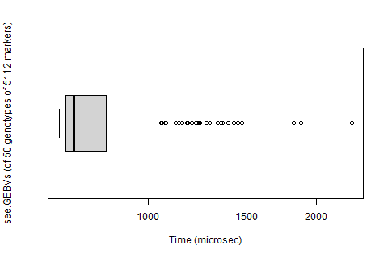

```{r, include = FALSE}
knitr::opts_chunk$set(
  collapse = TRUE,
  comment = "#>"
)
```

```{r setup}
library(genomicSimulation)
```


# Introduction
genomicSimulation is a simple, fast scripting simulation tool for creating 'digital twins' of breeding schemes. The package tracks genotypes at an individual level (rather than population overviews, or tracking inherited segments), and simulates crossing using stochastic simulation of diploid meiosis (including crossing-over but not mutation).

All core functionality is written in C. Performing the computation-intensive tasks at C-level allows for quick running times. However, this means the simulated data will not be visible to R until explicitly pulled into R's environment by one of the commands provided for this purpose.

For any feature requests, improvement requests, or to report any bugs or crashes, get in contact via https://github.com/vllrs/genomicSimulation/ or the maintainer email address in the R package DESCRIPTION file.

An early summary of this tool's design and performance is available in research paper format: http://dx.doi.org/10.1093/g3journal/jkac216. Some information (capabilities, function names) may be out of date.

The underlying C library is available at https://github.com/vllrs/genomicSimulationC/.

## Getting to know genomicSimulation

genomicSimulation exists as a set of functions that can be used in R scripts (like `load.genotypes`, `make.random.crosses`, and `see.optimal.haplotype`) plus an invisible table containing the current simulation's data.


Broadly speaking, the tool provides three main categories of functions for simulating ongoing operations in a breeding program:

- functions for creating more genotypes, 
- functions for reorganising/recategorising genotypes,
- functions for deleting groups of genotypes.

Simulation functions can be used in any order and interspersed in any way. The only fixed requirement of a valid genomicSimulation script is that the first command is `load.data()`, which initialises the invisible table and loads the list of tracked genetic markers.  

In genomicSimulation, every genotype is a member of a 'group', an abstract category represented by a number (the "group ID"). A genotype only belongs to one group at a time, but it can be moved between groups with great flexibility. Selection is simulated by pulling selected genotypes into a new group. Most crossing actions are performed by crossing members within a group to each other, or crossing members of two different groups. Groups can be combined, split randomly, or split along specific lines. Groups can be deleted to destroy the genotypes they contain. 

Using these two factors (each genotype belonging to a reconfigurable group, and simulation actions that can be undertaken in any order), genomicSimulation can simulate a broad range of breeding programs. As a small sample of possibilities, you could:

- simulate repeated crosses from a 'breeding pool' group, merging a selected subset of offspring back into the breeding pool.
- simulate a nucleus breeding system with several funneled breeding pools running simultaneously, each replenished by the best offspring of their own pool and whatever trickles down from more elite pools.
- simulate a breeding program with concurrent population development and population improvement streams, which splits off copies of certain genotypes to repeatedly self into homozygosity for commercialisation testing.

{width=100%}

As an R user, the functions `see.existing.groups()`, `see.group.data()`, and `see.group.gene.data()` are the easiest ways to access your simulation data. Other output formats are available via saving data to files.

# Speed

genomicSimulation currently makes no attempts to parallelise execution.

Three benchmarks of three frequently-used features of the package are presented. Benchmarking was performed using R package [microbenchmark](https://doi.org/10.32614/CRAN.package.microbenchmark) on genomicSimulation version v0.2.5.007. Benchmarking was not performed in an isolated testing environment, so results may be noisy.

## Set up simulation founders 
```{r table2, echo=FALSE, message=FALSE, warnings=FALSE, results='asis'}
tabl <- "
| Test Details  |  |
|---------------|---------------|
| R version     | R 4.3.1, running in RStudio       |
| Device        | Laptop, 16GB RAM, 11th Gen Intel i7 CPU, running Windows 11 |
| N replications | 500 |
| genomicSimulation command | load.data |
| Input size | 50 founder lines genotyped across a 5112-marker, 2994-centimorgan map | 
"
cat(tabl) # output the table in a format good for HTML/PDF/docx conversion
# Thanks https://stackoverflow.com/questions/19997242/simple-manual-rmarkdown-tables-that-look-good-in-html-pdf-and-docx
```

**Min:** 0.0164 seconds 
**Mean:** 0.0221 seconds 
**Max:** 0.0643 seconds 


## Simulate crossing
```{r table3, echo=FALSE, message=FALSE, warnings=FALSE, results='asis'}
tabl <- "
| Test Details  |  |
|---------------|---------------|
| R version     | R 4.3.1, running in RStudio       |
| Device        | Laptop, 16GB RAM, 11th Gen Intel i7 CPU, running Windows 11 |
| N replications | 100 |
| genomicSimulation command | make.random.crosses |
| Input size | 50 founder lines genotyped across a 5112-marker, 2994-centimorgan map | 
| N crosses simulated | 10^5 |
"
cat(tabl)
```

**Min:** 1.26 seconds 
**Mean:** 1.47 seconds 
**Max:** 1.82 seconds 


As the length of the chromosome increases, the average number of crossovers along the chromosome also increases (see [Methodology: Simulating meiosis](#methodology-simulating-meiosis)). The process of simulating meiosis on large chromosomes is slower, because genomicSimulation must currently compute the positions of each crossover. 

If simulating crossing operations takes substantially longer than the above benchmark suggests (on the order of several minutes, rather than seconds), and you do not expect to be simulating a much larger population or much larger genome, please check that the marker positions in the input genetic map file are indeed in centimorgans. Marker positions should not be provided in base pair units. Base pair positions are large numbers (often 6-7 digits long), and if those numbers are interpreted as centimorgan measurements, it would suggest that meiosis will involve a huge number of crossovers.

## Calculate breeding values
```{r table4, echo=FALSE, message=FALSE, warnings=FALSE, results='asis'}
tabl <- "
| Test Details  |  |
|---------------|---------------|
| R version     | R 4.3.1, running in RStudio       |
| Device        | Laptop, 16GB RAM, 11th Gen Intel i7 CPU, running Windows 11 |
| N replications | 500 |
| genomicSimulation command | see.GEBVs |
| Input size | 50 founder lines genotyped across a 5112-marker, 2994-centimorgan map | 
"
cat(tabl)
```

**Min:** 0.00069 seconds 
**Mean:** 0.00080 seconds 
**Max:** 0.00231 seconds 



`see.GEBVs` is a function that accesses simulation output within R. Forms of output that involve writing to files will be slower than methods of output that involve accessing data within R. 

Breeding values are expected to be the slowest kind of data output to access, because they are (re)calculated from raw alleles and marker effects every time they are accessed.

# Sample scripts

## Simple script

A simple simulation script using this package might involve these steps:

1. Load founder genotypes, genetic map, and marker effects for some target trait; save the group number of the founder lines. Use the function: `load.data`
1. Perform crossing between genotypes in the founder group. Keep a hold of the group number of these crosses. Example function: `make.random.crosses`
1. Perform selection on the F1 generation generated above. Example function: `break.group.by.GEBV`
1. Perform more crossing from the F1 generation (using the group number from the above step).
1. Repeat for further generations.
1. Save the final genotypes (or other final data). Example function: `save.genotypes`

The example below shows a how a typical workflow might save group numbers and call crossing functions.
```{R}
# (Show the tiny example data set)
read.csv("../tests/testthat/helper_genotypes.txt", sep='\t', header=T)
read.csv("../tests/testthat/helper_map.txt", sep='\t', header=T)
read.csv("../tests/testthat/helper_eff.txt", sep='\t')

# Starting to use genomicSimulation: load the small initial data set
init <- load.data("../tests/testthat/helper_genotypes.txt",
                "../tests/testthat/helper_map.txt",
                "../tests/testthat/helper_eff.txt")
g0 <- init$groupNum
# The other entries of the list 'init' are:
# map1 <- init$mapID #, the identifier of the genetic map loaded
# eff1 <- init$effectID #, the identifier of the effect file loaded

# Do random crosses from the progenitor lines. 
f1 <- make.random.crosses(g0, n.crosses=20, give.names=TRUE, name.prefix="F1.")

# Find the 25% with the top breeding value/GEBV
f1.selected <- break.group.by.GEBV(f1, percentage=25)

# Delete groups we are not currently using, to free up some memory.
delete.group(f1)

# Make 5 random crosses from those selected 25%
f2 <- make.random.crosses(f1.selected, n.crosses=5)
delete.group(f1.selected)

# Complete 4 rounds of selfing with save-as-you-go genotype saving
f6 <- self.n.times(f2, 4, file.prefix="af6", save.genotype=TRUE)
# alternatively, we could have removed {file.prefix="af6", save.genotype=TRUE} and instead 
# run, on the following line:
# save.genotypes("af6-genotype.txt", f6)

# Show current state of groups.
see.existing.groups()

# (These are the groups the above command should show)
print(c(g0, f2, f6))

# Show the save-as-you-go output file
read.csv("af6-genotype.txt", sep='\t')


# (cleanup)
file.remove("af6-genotype.txt")
```

## Tracking sex of genotypes

The preceding script, while not very realistic, was clearly inspired by plant breeding methods: four generations of selfing to produce a homozygous inbred for bulking and commercial release is not a usual strategy in animal breeding. Perhaps a key aspect in which animal breeding programs differ from a self-pollinated plant breeding program is that you can't cross just any animal with any other animal. In part, there's the higher importance of avoiding inbreeding, but also, there's the fact that animals come in male and female varieties.

genomicSimulation does not track sex of genotypes. The group system can however be used to that effect.

```{R}
# Starting to use genomicSimulation: load the small initial data set
init <- load.data("../tests/testthat/helper_genotypes.txt",
                "../tests/testthat/helper_map.txt",
                "../tests/testthat/helper_eff.txt")
cows <- init$groupNum
# Load the small initial data set again, pretending this is a different file that contains the bull genotypes
bulls <- load.genotypes("../tests/testthat/helper_genotypes.txt") 

# Create some offspring
f1 <- make.random.crosses.between(cows, bulls, n.crosses=5)

# Simulate the sex of offspring
temporary <- break.group.randomly(f1, into.n=2)
calvesF <- temporary[1]; calvesM <- temporary[2]; rm(temporary);

#... and so forth
```

Alternatively, a custom label could be used to track sex:

```{R}
# Starting to use genomicSimulation: load the small initial data set
init <- load.data("../tests/testthat/helper_genotypes.txt",
                "../tests/testthat/helper_map.txt",
                "../tests/testthat/helper_eff.txt")
cows <- init$groupNum
# Load the small initial data set again, pretending this is a different file that contains the bull genotypes
bulls <- load.genotypes("../tests/testthat/helper_genotypes.txt") 

# Define our interpretation of the custom label
FEMALE <- 1L
MALE <- 2L
# Create the label
sexLabel <- make.label(default=FEMALE)
change.label.to.this(sexLabel, MALE, group=bulls)

# Create some offspring
f1 <- make.random.crosses.between(cows, bulls, n.crosses=5)

# Simulate the sex of offspring
change.label.to.values(sexLabel, values=c(sample(c(FEMALE,MALE), size=5, replace=TRUE)), group=f1)

# Then split up your calves as needed
calvesF <- break.group.by.label.value(sexLabel, FEMALE, group=f1)
calvesM <- f1 #the calves left in F1 must be all the males
rm(f1)

#... and so on
```

## Selecting on simulated phenotypes

This script implements a custom selection function that selects the top 10 simulated crosses by phenotype. Because genomicSimulation offers no internal method for simulating phenotypes, we must simulate phenotypes in R, then use `make.group` to perform the selection.

Suppose we choose the following model for their simulated phenotype: $P = G + E$. The phenotypic values $P$ will be made equal to the breeding value genomicSimulation calculates ($G$) plus a value for environmental contribution ($E$) drawn from a normally distributed distribution with variance $V_e$, where $V_e$ comes from the equation $H^2 = V_g/(V_g + V_e)$.

For ease of simulation, $H^2$ is a known broad-sense heritability estimate for the phenotype, and $V_g$ is the variation in breeding values among the candidate genotypes from which they are selecting. Therefore, this approach uses the following steps to simulate phenotypes: 
1. calculate the magnitude of $V_e$ using the set of breeding values from the crosses on which selection is being performed
2. draw from a normal distribution to get simulated phenotypes

We first create the following R function to simulate phenotypes, then tell us the genomicSimulation indexes of the 10 candidates with the highest phenotype scores.

```{R}
get.top.10.phenotypes <- function(group, heritability) {
  info <- data.frame(Index=see.group.data(group,"X"),
                     GEBV=see.group.data(group,"BV"))
  
  # simulate phenotype = genotype + environmental variation
  # using normally distributed Ve and heritability H^2 = Vg/(Vg + Ve)
  Vg <- var(info$GEBV)
  Ve <- Vg/heritability - Vg
  info$Pheno <- info$GEBV + rnorm(length(info$GEBV), mean=0, sd = sqrt(Ve))
  
  # Return the genotype indexes of those with the top phenotype
  return( info[order(info$Pheno, decreasing=TRUE),]$Index[1:10] )

}
```

and then use it and `make.group` to make the selection:
```{R}
init <- load.data("../tests/testthat/helper_genotypes.txt",
                "../tests/testthat/helper_map.txt",
                "../tests/testthat/helper_eff.txt")
g0 <- init$groupNum

# Simulate crosses
f1 <- make.random.crosses(g0, n.crosses=15, offspring=3)
# Apply custom selection method
f1.selected <- make.group(get.top.10.phenotypes(f1, heritability=0.3))
# (delete the non-selected genotypes)
delete.group(f1); rm(f1)

# ... repeat for further generations
f2 <- make.random.crosses(f1.selected, n.crosses=100)
f2.selected <- make.group(get.top.10.phenotypes(f2, 0.5))

# ... and so on

delete.group(c(f1.selected,f2,f2.selected))
```

Genotype indexes should be re-calculated after every `delete.group` call. Because genotype indexes correspond to column numbers inside the invisible table, `delete.group`, which deletes genotypes, can potentially change which column number other genotypes are stored at. 

In the above example, the `info` data frame is created inside the `get.top.10.phenotypes` function and not used outside of it. This means it is only used at one time, in order to guarantee not using out-of-date genotype indexes. If you wanted to create a similar "`info`" data.frame in the main script body and re-use it later, either:

- Leave any `delete.group` calls until after the last use of `info`, or
- Replace the `info$Index` column after every `delete.group` call with the new output of `see.group.data(group,"X")`, or
- Do not have an `Index` column in `info`. Instead, create a column in `info` marking the rows you want to select (eg. `info$chosen = info$Pheno > 50`) Then use `make.group(see.group.data(group,"X")[info$chosen])`, accessing the candidate indexes at the same time as you call `make.group`.

Results from a simulation very similar to this sample script can be found in http://dx.doi.org/10.1093/g3journal/jkac216. 

# Input Files

The package's first command, used to set up or to reset the simulation, is `load.data`. This command takes up to three input files as parameters: a genotype matrix, a genetic map, and a list of marker effects. The genetic map and marker effects are optional (though, if no genetic map file is provided, a single-chromosome map with evenly spaced markers will be invented). The genotype matrix is also technically optional if a genetic map is provided, but since genomicSimulation has no genome-construction or mutation mechanisms, loading genotypes from a file is the only way to get your simulation population started.

At any point in simulation, more genotypes can be imported from files using the function `load.genotypes`. Similarly, alternative genetic maps and additional sets of marker effects can be loaded at any point in the simulation using `load.map` and `load.effects` respectively.

## Genetic map files

The simplest genetic map file is formatted as follows:
```
marker chr pos
m3 3 15
m2 1 8
m1 1 5
```
Other valid genetic map files might include:
```
chr marker pos
1A 1243509 173.2
1A 2350898 462.2
1B 4360992 32.009
2A 1243556 243.5
```
or
```
gene 10 3.24
othergene 10 8.3e-1
etc 15 1.203e2
```
Note that genomicSimulation takes genetic maps, not physical maps. Marker positions should be in centimorgans (and therefore correspond to crossover probabilities), not physical base pair counts. genomicSimulation will use these positions and the distances between them when [simulating meiosis](#methodology-simulating-meiosis), to calculate the probability of recombination occurring between markers.

The header line is optional. If there is a header line, any permutation of the three columns "marker", "chr", and "pos" is allowed. If the header is not provided, the order is assumed to be: marker name in the first column, followed by chromosome in the second column, followed by position in the third.

*About the column "marker", containing marker names*: Genetic markers should have names. These names can be entirely numeric. Though genomicSimulation will run without visible errors if some markers share names, this will cause issues when loading the genotype matrix: non-unique marker names may cause intended genotype data to be overwritten with alleles from a different marker with the same name, or to be left blank because the intended data was placed at the wrong marker. Therefore, it is recommended that marker names are unique.

*About the column "chr", containing chromosome/linkage group names*: any alphanumeric combination (of letters A-Z and digits 0-9) may be used to denote a chromosome/linkage group, for example '9' or '1A'. There is no limit on the number of unique chromosomes/linkage groups in the map.

*About the column "pos", containing marker positions*: should be the position in centimorgans of each marker along its chromosome/linkage group. (Distance of 1 cM = expected probability of 0.01 chromosomal crossovers in that range.)

Cells/table entries in the file may be separated by spaces, tabs, commas, or any combination thereof. Cell spacers do not need to be consistent across the file, but therefore marker names and linkage group names cannot contain spaces, tabs, or commas. 

The order in which genetic markers are presented in the file does not matter.

## Genotype matrix files

The simplest genotype matrix file is formatted as follows:
```
name	G01	G02	G03	G04	G05	G06
m1	TT	TT	TT	TA	TT	AT
m3	TT	TT	TA	TA	TT	TT
m2	AA	AA	AA	AA	CC	AA
```
where G01, G02, ..., are names of the founder genotypes; m1, m2, ..., are the genetic markers; and entries in the matrix are the alleles that the founder genotypes have at those markers. 

Other valid genotype matrix files might include:
```
 m100, m101, m102
cand1,0,0,1
cand2,1,2,2
cand4,2,1,2
```
or
```
marker1	T/T	T/T	T/T	T/A	T/T	A/T
marker3	T/-	T/T	T/-	-/A	T/T	T/T
marker2	A/A	A/A	A/A	A/A	T/T	A/A
```

The genotype matrix can be row-major or column-major (that is, the genetic markers may be rows, or columns). genomicSimulation will guess the orientation by attempting to match row and column headers with the names of genetic markers extracted from the first genetic map file. If the simulation does not yet have a list of tracked markers (that is, no genetic map has been simultaneously or previously provided), then it defaults to assuming that rows represent genetic markers.

The order in which genetic markers are presented in the file does not matter. Candidate genotypes, however, will be saved internally in the simulation in the order that they appear in the file. 

Genetic marker names are required, whether they are row headers or column headers. Candidate/genotype names are optional if candidates are stored as columns, but genomicSimulation cannot read a gentoype matrix with no row headers, so if candidates are stored as rows, they are required to have names in the first column. Candidate names do not have to be unique.

When there are both row and column headers, the first cell/corner cell (the one that contained the value "name" in the first example above) can contain any text, can be empty, or can not exist at all (i.e. the header row can be one cell shorter than the other rows). In any case, the corner cell is ignored.

The table cells in the genotype matrix file may be separated by spaces, tabs, commas, or any combination thereof. Cell spacers do not need to be consistent across the file. This does mean, however, that candidate names, marker names, the value of the corner cell, and the alleles in the table, cannot contain spaces, tabs or commas.

All cells in the body of a genotype matrix should use the same format for storing allele pairs. There are four accepted formats for allele pairs:

1. Pairs of characters (eg. "AA", "TA", "nW"). Each character is an allele. This is a format that specifies allele phase (ie. "AT" and "TA" are different genotypes).
2. Pairs of characters, separated by a forwards slash "/" character (eg. "A/A", "T/A", "n/W"). The two characters either side of the slash are the alleles. This is a format that specifies allele phase (ie. "A/T" and "T/A" are different genotypes).
3. Alternate allele counts ("0", "1", "2"). This is a format that does not specify allele phase, so phase of heterozygotes will be randomised when loaded. The counts represent the number of copies of the alternate allele (stored inside genomicSimulation as "A", while the reference allele is stored as "T"). "0" then corresponds to "TT", "2" to "AA", and "1" will be randomised as either "TA" or "AT". Corresponding marker effect files must use allele "A" consistently to represent the alternate allele, and "T" to represent the reference. (alternatively, `change.allele.symbol` can be used after loading to change T and/or A to other symbols, to match a marker effect file.)
4. (A subset of) the IUPAC encodings of DNA bases ("G", "A", "T", "C", "R", "Y", "M", "K", "S", "W", "N"). This is a format that does not specify allele phase, so phase of heterozygotes will be randomised when loaded. See below for meanings of the IUPAC encoding symbols that genomicSimulation can parse.

```{r table1, echo=FALSE, message=FALSE, warnings=FALSE, results='asis'}
tabl <- "
| IUPAC symbol  | genomicSimulation genotype |
|---------------|---------------|
| G | GG |
| A | AA |
| T | TT |
| C | CC |
| R | GA or AG |
| Y | TC or CT |
| M | AC or CA |
| K | GT or TG |
| S | GC or CG |
| W | AT or TA |
| N | \\0\\0 (nulls represent unknown genotype) |
"
cat(tabl)
```

**If you have a genotype matrix of only "AA", "AT", and "TT": such a matrix uses "alternate allele counts"-style encoding (like format 3) but presents it in a format that looks like pairs of alleles (format 1).** genomicSimulation expects allele pair encodings to include haplotype phase, (that is, to have four possible values for genotypes of two alleles, not three: eg. "AA", "AT", "TA", and "TT" instead of just "AA", "AT", "TT"). To load a dataset with non-phased "AA"/"AT"/"TT" allele pairs, you might:

- Use haplotype phasing/haplotype inference software to infer whether heterozygotes are "AT" or "TA", before loading into genomicSimulation.
- Find-and-replace "TT" with "0", "AT" with "1", and "AA" with "2" before loading into genomicSimulation. genomicSimulation will then randomise the phase of each genotype.

As may be clear from these accepted input formats, every genotype in genomicSimulation has exactly two alleles at each marker - that is, genomicSimulation simulates diploid genotypes. 

An allele in genomicSimulation can be represented by any single character. Specifically, this means any value that can be stored in a *char* from the C programming language (one byte). 

An allele can be a letter, but can also be a digit, a punctuation mark, or an unprintable control character. Via calling `change.allele.symbol` after the file is loaded, an allele can even be a space, comma, tab or newline character (even though these are not permitted as alleles in the input file and would make for strange-looking output files). 

This means SNP markers can be represented with the two alleles 0 and 1, or A and T, etc., according to your preference. On the other end of the spectrum, a marker could also represent an abstracted Mendelian gene with alleles, say, A, a, t, +, and o.

If you have missing data in your input dataset, you choose how to represent the missing alleles in the genotype file (the letter 'N'? the dash '-'? the null character?). "Missing" alleles function identically to other alleles, and will propagate through the generations just like other alleles. Therefore, offspring genotypes can inherit an unknown/missing allele from a parent. 

If the format of the genotype matrix input file is detected incorrectly by genomicSimulation, the optional `format` parameter of `load.data` or `load.genotypes` can be used to specify the correct format (see [Incorrect File Format Detection](#incorrect-file-format-detection)).

## Marker effect files

Loading marker effect file(s) is optional for running the simulation. There is no need to provide marker effects if genetic breeding values are not going to be used. The simplest marker effect file is formatted as follows:
```
marker allele eff
m1 A -0.8
m2 A -0.1
m3 A 0.1
m1 T 0.9
m3 T -0.1
```
Other valid marker effect files might include:
```
marker eff allele
m1243509 0.1 A
m1243509 -0.1 T
m2350898 0.15 T
m2350898 -0.1 A
```
or
```
specialgene G 1.0
```

One marker effect file represents the contributions/effects of alleles on one trait. Multiple marker effect files can be loaded to use each to represent a different trait.

The header line is optional. If there is a header line, the three columns "marker", "allele", and "eff" can appear in any order. If the header is not provided, the order is assumed to be marker name in the first column, followed by allele, followed by additive effect value.

The order of the rows in the file does not matter. If multiple rows exist in the file for the same marker name/allele combination, only the last row's additive effect value will be saved. 

*About the column "marker", containing marker names*: Rows whose marker name does not match a marker name from the primary (first-loaded) map will be skipped and ignored.

*About the column "allele", containing the symbol representing an allele*: This column should be the allele (a non-space, non-tab, non-comma character, eg "A"). 

*About the column "eff", containing the marker effect of this allele*: This column should be a decimal representing the additive effect value of carrying one copy of the same-row allele for the same-row marker. It can be positive or negative or zero, and can be represented by a decimal, a whole number, or scientific notation. 

Cells may be separated by spaces, tabs, commas, or any combination thereof. Cell spacers do not need to be consistent across the file. 

## Incorrect file format detection
All file loading functions print out diagnostic messages describing the size and format of the table they believe they have loaded. **You should read these diagnostic messages the first time you load a particular set of data files, to check the detected file sizes and formats are what you expect.** It is possible some discrepancy between marker names in the map and marker names in the other files meant you loaded empty genotypes, or all marker effects were discarded. Or it is possible that genomicSimulation detected the file format incorrectly.

If the diagnostic messages are incorrect about the layout of your map file or effect file, the most likely cause is a mis-spelling in the header row of the file. Column headers in the map file or effect file need to be exact matches to the names shown in the examples in the previous sections of this document (eg. "eff", not "effect" or "marker-effect")

If the diagnostic messages are incorrect about the size of the table in your map file or effect file, the issue may be that the numbers cannot be detected as numbers, or that there are issues with the column spacers/line breaks that cause there to be more than three entries to a row.

If the diagnostic messages are incorrect about the layout or format of your genotype matrix file, you can manually specify the file format for genomicSimulation, using the function `define.matrix.format.details`. It is not required that you manually specify all details of the file format if you use `define.matrix.format.details`: you can specify only the elements that genomicSimulation is detecting incorrectly. Whatever details of the file format are not manually specified will be automatically detected.

## Loading from other file formats
Updates to expand the range of allowed input formats are in development.

# Simulation management functions

This section describes the available functions for setting up the simulation, customising metadata and printing, and cleaning up simulation data.

## Index of simulation management functions

*More information is available in function documentation (eg. `?load.data`).*

### Functions for loading input data
Input to genomicSimulation from R dataframes or matrices is not currently possible. genomicSimulation can only load its input data from files.

It is recommended that the first time you load a set of data files, you read the output printed by genomicSimulation. Check that it has successfully read the correct number of rows, and that the automatically detected file formats are correct. 

- `load.data` : The first function called in any simulation. Load initial genotypes, an initial map, and/or initial marker effects for calculating breeding values. Either the genotype matrix or the genetic map file must be provided, at minimum. See the [Input Files](#input-files) section in this vignette for more details.
- `load.map` : Import an additional genetic map from a file (any file format accepted for the `map.file` of `load.data` will also be accepted here). The function returns the map ID of the newly loaded map. This ID can be passed to the `map` parameter of crossing functions to tell them to use this map when simulating meiosis, instead of the default map. Additional maps cannot introduce any new genetic markers to the simulation, only reorder genetic markers that were already present in the initial map provided to `load.data`. A possible use case for additional maps might be for simulating different crossover rates or recombination landscapes between sexes.
- `load.genotypes` : Import additional genotype(s) into the simulation from a file (any file format accepted for the `allele.file` of `load.data` will also be accepted here). The function returns the group ID of the newly-formed group into which the genotypes were loaded. 
- `load.effects` : Import an additional set of marker effects from a file (any file format accepted for the `effect.file` of `load.data` will also be accepted here). The function returns the marker effect set ID of the newly loaded marker effects. This ID can be passed to the `effect.set` parameter of breeding value calculation functions to use this set of marker effects to calculate the breeding values.
- `define.matrix.format.details` : The package attempts to automatically detect the format of the input files from among the available formats. If it incorrectly detects the format of the genotype matrix of `load.data` or `load.genotypes`, this function can be used to re-load the file and parse its format correctly. When calling this function, specify the correct values of the components of the genotype file format that were incorrectly detected. It returns a value that can be passed to the `format` parameter of `load.data` or `load.genotypes`.

It is up to the simulation user to record whether a given number (such as the return values from these functions) is a group ID, a map ID, a marker effect set ID, or something else. In the current version of the package, there is nothing in the R environment that distinguishes a group ID from a map ID, or a map ID from a marker effect set ID.

### Functions for managing custom labels

See [Primer on Custom Labels](#primer-on-custom-labels). 

- `create.new.label` : Create a custom label. This function returns the ID of the custom label.
- `change.label.by.amount` : Increment or decrement the value of a custom label for certain genotypes by some specified amount. For example, increasing the custom label representing age by 1 after each simulation year. 
- `change.label.default` : Change the default value of a custom label. Genotypes generated in simulation or loaded from a file after this function call will have this new default value as their value for the custom label.
- `change.label.to.this` : Change the value of a custom label for certain genotypes. 
- `change.label.to.values` : Change the values of a custom label for certain genotypes. Unlike `change.label.to.this`, which would set the value of the custom label to the same number for every genotype, this function takes a vector of values, and each genotype's value for the label is set to the corresponding value in the vector.

### Functions for deleting simulation objects

- `delete.group` : Deletes and clears data associated with a particular group of genotypes. You might use this to discard "dead" or "lost" genotypes, or previous generations that you are finished with, in your simulation, to free up computer memory. However, genomicSimulation does not retain the pedigree of deleted genotypes, so if later calculating pedigree trees, the parents of deleted genotypes will be unknown.
- `delete.map` : Deletes and clears data associated with a particular recombination map. 
- `delete.effects` : Deletes and clears data associated with a particular set of marker effects. 
- `delete.label` : Deletes and clears data associated with a particular custom label.

Note that after calling `delete.group`/`delete.label`/`delete.recombination.map`/`delete.effect.set`, the underlying simulation data may be deleted but the R variable holding the group/custom label/map/marker effect set ID will still exist. You may wish to call `rm` after calling a the `delete.` function, on the variable holding the corresponding ID (eg `delete.recombination.map(map1); rm(map1);`).

It is possible for IDs (group, custom label, map, or marker effect set IDs) to be reused after deletion. For example, if you delete group 2, then perform a crossing operation, the simulation could allocate the progeny of that cross to a new group whose group ID is also 2.

- `clear.simdata` : Reset the simulation and clear all data. The simulation is also cleared and reset every time `load.data` is called, because currently, genomicSimulation in R cannot have two concurrent simulation states in the same R session.

### Functions for tidying simulation output

- `change.allele.symbol` : An allele in genomicSimulation is any single character. This function can be used to change the character for an allele in all genotypes carrying that allele in the simulation. For example, to change all '1' alleles into 'A' alleles. Be warned: breeding values may change as a result of this change, because the change does not affect marker effect sets (that is, a marker effect associated with '1' will still be associated with '1' after this function call, even if there are no more '1' alleles because they are now called 'A'). Also, be warned: this function is not reversible. If there were already 'A' alleles, after a function call changing '1' into 'A', there is no way to distinguish between the originally-'A' alleles and the originally-'1' alleles. This function might be useful for standardising the representation of missing alleles if there were multiple missing-allele symbols in the input file, or might be useful for changing the default 'A' and 'T' allele representations produced from loading an allele counts file ([cell style 3](#genotype-matrix-files)) to the representations used for the alternate and reference allele in the effect file.
- `change.names.to.values` : Genotypes in genomicSimulation may or may not have names. These are used, where available, when printing output, and can be used to identify genotypes when making targeted crosses. This function can be used to set genotype names.

### Functions to add centring to breeding value calculations

By default, breeding values are calculated in genomicSimulation by calculating the sum across markers and alleles of the product of allele counts (0, 1, or 2) and corresponding marker effects (see [Methodology: Breeding value calculation](#methodology-breeding-value-calculation)). If the breeding value contribution of the alleles at particular markers should be centred/offset by some value, centring values can be added to a set of marker effects. Once centring values are added, they are part of the set of marker effects and are used whenever that set of marker effects are used to calculate breeding values. At the moment, centring values cannot appear in the input effect file, so they must be created/set using one of the following functions.

- `change.eff.set.centres` :  This function can be used to set the centring values of markers in a set of marker effects. Centring values are subtracted from the contribution of a marker to the overall breeding value. 
- `change.eff.set.centres.of.allele` : This function can be used to set there to be values that, when calculating breeding values, should be subtracted from the count (0, 1, or 2 copies) of an allele before that count is multiplied by the marker effect. That is, the marker effect for the specified allele at the specified marker is multiplied by $0-x$, $1-x$, or $2-x$ instead of 0, 1, or 2. This may be relevant, as an example, if the marker effects were calculated using GBLUP with a Z-matrix calculated by subtracting a value from every column of the count matrix (with entries 0, 1, or 2), then, using this function, the allele centres in genomicSimulation should (also) be set to that value, so that genomicSimulation calculates breeding values correctly. If $2p_i - 1$ was subtracted from every column of the count matrix, where $p_i$ is the frequency of the alternate allele at marker $i$, then this function should be used to set the allele centring to $2p_i - 1$ inside genomicSimulation too. 

### Functions for defining subgroups of markers

genomicSimulation can calculate local breeding values/segment scores, which are breeding values calculated across only a subset of markers and per haplotype rather than per diploid genotype. One of the required inputs for this calculation a `MarkerBlocks` object, which represents the subset(s) of markers.

- `create.markerblocks` :  This function returns a reference to a `MarkerBlocks` object, which stores one or more subsets of the markers in the simulation, and can be passed to local breeding value calculation functions to define the blocks of markers over which to calculate local breeding values. The `MarkerBlocks` object is automatically deleted when it is removed from the R environment, so unlike most genomicSimulation return values, it has no corresponding `delete.` function.
- `create.markerblocks.from.chrsplit` : A function that provides a shortcut for creating disjoint blocks of markers based on lengths of chromosome. It divides each chromosome into $n$ segments by genetic distance, where $n$ is a parameter to the function, and allocates the markers within each segment to a block. It returns a reference to a `MarkerBlocks` object containing these blocks, which can be passed to local breeding value calculation functions.

## Methodology: Breeding value calculation

The terms 'breeding value', 'genetic breeding value' and 'GEBV' (Genetic Estimated Breeding Value) are used interchangeably in the package, because the simulation is ignorant of whether the marker effects are estimated or 'true'. By default and if not otherwise specified by providing a marker effect set ID, all breeding value calculations use the earliest-loaded non-deleted set of marker effects.

The package's internal GEBV calculator uses an additive model of trait effects. The diagram shows how breeding value calculation is performed. The count of each allele in a genotype is multiplied by the effect of that allele at that marker. Centring values (if set. See [Functions to add centring to breeding value calculations](#functions-to-add-centring-to-breeding-value-calculations)) are subtracted from these numbers, and the whole sum of the remaining scores becomes the breeding value.

Markers and alleles not mentioned in the effect file contribute nothing to the breeding value/score.

Allele centring values created using `change.eff.set.centres.of.allele` will be pre-processed so they can be stored as marker centring values (like those created by `change.eff.set.centres` and seen in the diagram). The processed allele centring values will have the same mathematical effect as subtracting them from the allele count before multiplying to the marker effect, even if they seem to be stored as marker centring values.

![Diagram example of the process of calculating the breeding value of a genotype according to a certain set of (additive) marker effects. For each marker, the number of copies of each allele that has a known effect is counted, then that count is multiplied by the effect. All the allele contributions are summed, and then all the centring values are subtracted from that sum to produce the breeding value. If no marker centring values have been set, then all centres are effectively zero and the overall breeding value is the same as the sum of the breeding value contributions of all markers in the genotype.](bvcalculation_wcentres.png){width=100%}

# Crossing functions

This section describes the available functions for generating new genotypes from parent genotypes.

## Index of crossing functions

*More information is available in function documentation (eg. `?make.random.crosses`).*


Because it was initially created for simulating plant breeding programs, the package does not automatically track sex.

All crossing functions return a group ID representing the newly-created group which contains the offspring genotypes generated in the operation.

- `make.random.crosses` : Cross randomly picked genotypes from a group to each other. Optionally, there can be a cap on how many times any group member can be used as a parent of a cross.
- `make.random.crosses.between` : Cross randomly picked genotypes from one group to randomly picked genotypes from another. Optionally, there can be caps on how many times any member of the first group can be used as a parent, or how many times any member of the second group can be used as a parent. Different recombination maps can be used to produce gametes from the parents from the first group and the second group.
- `make.targeted.crosses` : Cross specific provided pairings. Pairings can be provided as pairs of genotype names, or as pairs of genotype indexes. Genotype indexes can be accessed using the function `see.group.data`. Different recombination maps can be used to produce gametes from the first parent and the second parent of each cross.
- `make.all.unidirectional.crosses` : Cross every possible combination of the genotypes in a group (a half-diallel).

- `self.n.times` : Create offspring from mating each genotype in a group to itself. This function also offers the option to perform multiple generations of selfing in one command. 
- `make.doubled.haploids` : Create a doubled haploid from each genotype in a group. 
- `make.clones` : Clone each genotype in a group. Optionally, you can also set each clone to inherit the name of its parent. 

The following functions do not add any functionality not possible with the other operations, but may be easier to use for specific use cases.

- `make.crosses.from.file` : Equivalent of `make.targeted.crosses`, if the crossings are stored as pairs of names in a file. 
- `make.double.crosses.from.file` : Function for the specific use case of making crosses between the progeny of certain known pairings, when those progeny do not have known names or known genotype indexes. The names of the grandparents of the desired crosses should be stored in a file (one quartet of grandparents per row). The function will search for genotypes with those parents and then cross them to produce the desired double crosses.

## Common settings for crossing functions

Every crossing function has the following optional parameters:

- `offspring`: The number of progeny to produce from each cross. Default value: 1

- `retain`: True/false logical value, representing whether to save the genotypes into simulation memory, or to immediately discard them. You might discard the offspring but save results to a file (using the save-as-you-go settings below) if you are generating too many crosses to store in memory. Default value: true (retain the genotypes)

- `give.names`: True/false logical value, representing whether or not to automatically generate names for the new genotypes generated. Automatically generated names are constructed from `name.prefix` and the genotype's pedigree ID. If you do not wish to automatically generate offspring names, they can remain nameless, or you can name them later using `change.names.to.values`. Default value: false (do not generate names)
- `name.prefix`: If `give.names` is true, the offspring are given names generated by concatenating this prefix and the offspring's pedigree ID. For example, if `give.names` is true and `name.prefix` is "F1_", then an offspring genotype with ID 20 generated by this function would be named "F1_20". Default value: NULL (no prefix)

- `give.ids`: True/false logical value, representing whether or not to allocate a pedigree ID to each offspring genotype. There is no opportunity to add a pedigree ID to a genotype later. If a genotype does not have a pedigree ID, pedigree tracking cannot identify, later, that it is the parent of its progeny. You might set this to FALSE if you are discarding the offspring (eg. `retain=FALSE`), or if the simulation is large and long enough that you risk ID overflow (on most systems, that would be if you generate more than 4,294,967,295 genotypes over the course of a single simulation). Default value: true (allocate pedigree IDs)

- `file.prefix`: The prefix for file names produced if `save.pedigree=TRUE`, `save.gebv=TRUE`, or `save.genotype=TRUE`. Default value: "out"
- `save.pedigree`: True/false logical value. If TRUE, saves the pedigree of each offspring genotype generated in this call to the file called "{`file.prefix`}-pedigree.txt" (eg., if `file.prefix` is "out", to the file "out-pedigree.txt"). Pedigrees are saved in recursive format (equivalent to `save.pedigrees` with `recursive.format = TRUE`). Default value: false (do not produce save-as-you-go pedigree file)
- `save.gebv`: Zero, or a valid marker effect set ID. If it is nonzero, calculates breeding values using the corresponding set of marker effects, and saves those breeding values to the file "{`file.prefix`}-bv.txt" (eg., if `file.prefix` is "out", to the file "out-bv.txt"). The output format is equivalent to `save.GEBVs`. Default value: 0 (do not produce save-as-you-go breeding value file)
- `save.genotype`: True/false logical value. If TRUE, saves the offspring genotypes generated in this call as a genotype matrix to the file "{`file.prefix`}-genotype.txt" (eg., if `file.prefix` is "out", to the file "out-genotype.txt"). In the output matrix, genotypes are saved as rows and genetic markers as columns. Columns are tab-separated. The output format is equivalent to `save.genotypes` with `markers.as.rows = FALSE`. Default value: false (do not produce save-as-you-go genotype file).

## Methodology: Simulating meiosis

To perform a cross, the simulation generates gametes independently from each of the two parents. No distinction is made between male and female parent, except that it is possible to generate gametes from the first and second parent using two different recombination maps in some crossing functions, like `make.random.crosses between`. Simulation of meiosis is also independent between different crossing operations - the second gamete produced by simulation of meiosis is discarded, not saved for later.

A gamete is generated according to one of the genetic maps in the simulation. By default and if not otherwise specified by providing a map ID, it uses the earliest loaded non-deleted map. 

For each chromosome, the number of crossovers to occur in the simulated meiosis are drawn from a Poisson distribution whose parameter is the length of the chromosome in Morgans, (that is, the distance between the first and last marker on the chromosome according to the selected genetic map, divided by 100).

The positions of those crossovers along the chromosome are then drawn from a uniform distribution.

Finally, a random logical value (0 or 1) is drawn to choose which of the parent's chromosomes to start with (which of the two gametes produced to use).  Note that this means that allele order in parents matters, and the simulated genotypes that are produced include haplotype phase.

genomicSimulation simulates meiosis but not mutation. Every allele in a genotype generated in the simulation is a copy of one of its parents' alleles.

The R package uses the R random generators, so will follow the R seed.

{width=100%}

# Selection functions

This section describes the available functions for selecting and recategorising genotypes. 

## Index of selection functions 

*More information is available in function documentation (eg `?make.group`).*

Selection functions involve breaking up or merging together groups of genotypes.

- `combine.groups` : Combine two or more groups into a single group. Returns the group ID of the combined group.

- `break.group.by.GEBV` : Extract the genotypes with the highest or lowest breeding values. Returns the group ID of the new group containing the genotypes that were extracted/that met the criteria.
- `break.group.into.families` : Split a group into one or more groups, such that every genotype in each new group has the same two parents. Returns the group IDs of the family groups created.
- `break.group.into.halfsib.families` : Split a group into one or more groups, such that every genotype in each new group has the same first parent (or has the same second parent if the `parent` parameter is 2, rather than 1). Returns the group IDs of the halfsib families created.
- `break.group.into.individuals` : Allocate each genotype in a group to a new group containing itself and no other members. Returns the group IDs of the individual groups created.

- `break.group.evenly` : Distribute the genotypes in a group randomly between $n$ groups of equal size. Returns the group IDs of the equally-sized groups created. 
- `break.group.into.buckets` : Distribute the genotypes in a group randomly between a specified number of groups with specified sizes. It is equivalent to `break.group.evenly`, but you can specify the size of the groups, rather than all groups being the same size. Returns the group IDs of the groups created. 
- `break.group.randomly` : Allocate each genotype in a group randomly to one of $n$ groups with equal probability. Unlike `break.group.evenly`, the $n$ groups are not guaranteed to be the same size. Returns the group IDs of the groups created.
- `break.group.with.probabilities` : Allocate each genotype in a group randomly to one of a specified number of groups, with specified probability of being allocated to each group. It is equivalent to `break.group.randomly`, but the probabilities of ending up in each group do not have to be equal. Returns the group IDs of the groups created.

- `break.group.by.label.range` : Extract the genotypes from a group that have values of a custom label within a certain range. Returns the group ID of the new group containing the selected genotypes.
- `break.group.by.label.value` : Split a group into one or more groups, such that every genotype in each new group has the same value for a custom label. Returns the group IDs of the groups created.

- `make.group` : Pass this function a list of genotype indexes, and it will move them all out of their original group(s) into a new group. Returns the group ID of the new group created.

## Primer on Custom Labels

A custom label is an attribute or tag on every genotype in the simulation. The value of the custom label for each genotype is stable until changed by the user: you choose what value it has for each genotype, and when to change it. 

Custom labels can be used to track information about a genotype that you wish to survive group splits and merges. For example, it may be used to track age or sex of each genotype. 

Values of a custom label can only be whole numbers, so you may need to invent your own encodings. *Age (measured in years)* is an easy one: you can increment the age of all genotypes using `change.label.by.amount` after every simulation year. For a custom label tracking sex, you may need to choose that females are labelled 1 and males are labelled 2, or other numbers of your choice. 

An example of using custom labels to track sex can be found in the example script [Tracking sex of genotypes](#tracking-sex-of-genotypes) in this document. Other examples of using custom labels exist in the [Features and Template Guide](https://vllrs.github.io/genomicSimulationCdocs/v0.3/templates.html) (online link).

## Primer on custom selection functions

For selection methods more sophisticated than the simple ones listed above, you can script your own selection functions in R. 

The general process for custom selection methods involves accessing the raw data needed for the selection method, as well as the genotype indexes of the selection candidates (using `see.group.data`). Then, within R, determine the indexes of the genotypes to select, and finally pass those chosen genotype indexes to `make.group`, which will create a new group containing the selected genotypes.

An example of this process can be found in the example script [Selecting on simulated phenotypes](#selecting-on-simulated-phenotypes) in this document. 

# Output functions

This section describes the available functions for accessing and saving data from the simulation.

## Index of R output functions

*More information is available in function documentation (eg. `?see.group.data`).*

- `see.existing.groups` : Returns a table of the groups in the simulation at the current time, and how many genotypes are in each group. 
- `see.group.data` : Returns data about each genotype in a group. A data.frame can be constructed from the vectors returned by this function: for example, `groupInfo = data.frame(Index=see.group.data(group,"X"), GEBV=see.group.data(group,"BV"))`. The choice of data type to access is made using the `data.type` parameter. The beginning of the `data.type` string is matched (case-insensitively) to one of the following keys. That is, both `data.type="N"` and `data.type="name"` will access data of type **N**: Names. 
	- **N**: Names
	- **D**: Pedigree IDs. A pedigree ID is unique to a genotype for the lifetime of the simulation.
	- **X**: Indexes. The index (position in [the internal table](#visualisation-of-the-invisible-table)) of a genotype might change every time `delete.group` is run. Therefore, you must remember to discard (and, if necessary, recalculate) all vectors or data frame columns containing genotype indexes every time you call `delete.group`.
	- **G**: Genotypes. Genotypes (sequences of alleles) are provided as strings. `see.group.gene.data` provides genotypes as columns in a matrix, which may be easier to work with.
	- **B**: GEBVs/breeding values. The additional parameter `effect.set` can be used to
	select which marker effects set to use to calculate the breeding values. It defaults to the first loaded set of effect values.
	- **L**: values they hold for a custom label. The additional parameter `label` can be used to select which custom label's values are accessed. It defaults to the first-created custom label.
	- **P1D**: Pedigree ID of its first parent.
	- **P1**, but not followed by the letter D: Name of its first parent.
	- **P2D**: Pedigree ID of its second parent.
	- **P2**, but not followed by the letter D: Name of its second parent.
	- **PED**: Full/recursive known pedigree, as a string.
- `see.group.gene.data` : Returns an allele matrix or a count matrix. Each column in the matrix will correspond to a genotype, and each row to a genetic marker. Entries in the matrix can either contain the pair of alleles (eg. "AB") of that genotype at that marker, or can contain the number of copies of a certain allele (0 or 1 or 2) in that genotype at that marker. The null character cannot be displayed in R, so `see.group.gene.data` includes a parameter for choosing the character that will replace any null character alleles in the matrix.
- `see.GEBVs` : Equivalent to `see.group.data(..., data.type="B")`
- `see.local.GEBVs` : Returns a matrix of local breeding values. Each row of the matrix will correspond to the local breeding values for one haplotype of each genotype in the group, and each column of the matrix will correspond to one block of genetic markers (see `create.markerblocks`). 

- `see.minimal.GEBV` : Returns the lowest possible breeding value score that could be calculated using a hypothetical genotype and the coefficients from a certain marker effect set.
- `see.optimal.GEBV` : Returns the highest possible breeding value score that could be calculated using a hypothetical genotype and the coefficients from a certain marker effect set.
- `see.optimal.haplotype` : Returns the hypothetical haplotype with the highest possible breeding value score that could be calculated using a certain marker effect set. 
- `see.optimal.possible.GEBV` : Returns the highest possible breeding value score that could be calculated using only alleles that appear in a certain group of genotypes and the coefficients from a certain marker effect set.
- `see.optimal.possible.haplotype` : Returns the hypothetical haplotype with the highest possible breeding value score that could be calculated using a certain marker effect set and using only alleles that appear in a certain group of genotypes.

- `see.genetic.map` : Returns a table containing the information used to simulate meiosis: genetic markers tracked by the simulation, and their chromosome allocations and positions.
- `see.marker.effects` : Returns a table containing the information used to calculate breeding values: genetic markers with associated marker effects, the alleles and effect values at those markers, and any centring value associated with that marker. 
- `see.markerblocks` : Returns a table containing information about the blocks in a  `MarkerBlocks` object: how many different blocks of markers it contains, as well as which markers are part of each block. 

## Index of file output functions

*More information is available in function documentation (eg. `?save.genotypes`).*

- `save.genotypes`: Save an allele matrix to a file.

The default output format of `save.genotypes` has `markers.as.rows = FALSE`. Save-as-you-go genotype output from crossing functions also uses this default format. The format is a tab-separated matrix, with markers as columns and genotypes as rows:
```
	m1	m2	m3
F107	TT	AA	TT
F108	TT	AA	TT
F109	TA	AA	TT
```

In this example, the genotypes have names ("F107", "F108" and "F109"). If the genotypes did not have names, their Pedigree IDs would be used instead.

If `save.genotypes` is called with `markers.as.rows = TRUE`, it will produce the following format, which is the transpose of the matrix above:
```
   F107   F108   F109
m1 TT     TT     TA
m2 AA     AA     AA
m3 TT     TT     TT
```

If the members of a specific group are saved, rather than every genotype in the simulation, the output format will include the group number in the corner cell of the table. For example, if group 5 had members F107 and F108:
```
5	m1	m2	m3
F107	TT	AA	TT
F108	TT	AA	TT
```

- `save.allele.counts` : Save a matrix of allele counts to a file. The format of the output file is the same as that of `save.genotypes`, except instead of pairs of alleles in the body of the matrix, it will be the number of copies (0, or 1, or 2) of the target allele in that genotype at that marker. 

- `save.GEBVs` : Save breeding values of genotypes to a file. 

The output file from `save.GEBVs` is a three-column tab-separated file. The first column contains pedigree IDs, the second column contains the genotype names, and the third contains the calculated breeding value of each genotype. If a genotype has no name, the second column is blank. If a genotype has no pedigree ID, the first column contains 0. 

- `save.local.GEBVs` : Save a matrix of local breeding values to a file. 

`save.local.GEBVs` saves the same matrix produced by `see.local.GEBVs`. This matrix has columns corresponding to local regions/marker blocks, and rows corresponding to haplotypes of each genotype in the group. It is saved to a tab-separated file:
```
F107_1	0.833333	-0.100000
F107_2	0.200000	-0.172000
F108_1	0.700000	-0.150000
F108_2	1.100000	-0.100000
```

The file has no header row, because the marker blocks do not have names. The header column contains genotype names with either the suffix "_1" or "_2", depending on if the row corresponds to the first or second haplotype of that genotype. If genotypes do not have names, the header column contains only "_1" or "_2".

- `save.pedigrees` : Save the pedigrees of genotypes to a file.

The default output format of `save.pedigrees` has `recursive.format = TRUE`. Save-as-you-go pedigree output from crossing functions also uses this default format.
```
10	F2010=(F107(G01,G02))
11	F2011=(F108(G01,G03),F109(G02,G03))
```
The function is recursive and will continue to track back to find parents until it reaches a genotype with unknown parentage. If, before it reaches a genotype with unknown parentage, it finds one with a parent that does not exist anymore (that is, a parent that has been deleted), it treats that genotype as having unknown parentage and also prints a warning to the user that they may have prematurely deleted some genotypes. Users who did intend to perform that deletion and wish to avoid this warning should turn ID allocation off when generating to-be-deleted genotypes: see [Common settings for crossing functions](#common-settings-for-crossing-functions).

Note that in the example above, F2010 is produced by selfing, cloning, or doubling a haploid of F107, while F2011 is a cross.

Calling `save.pedigrees` with `recursive.format= FALSE` saves in the following format, even if grandparents and beyond are known:
```
F2010   F107   F107
F2011   F108   F109
```
This is a tab-separated text file. The first column is the child name, and the next two columns are the names of its immediate parents (or single parent duplicated if it was produced by selfing or doubling haploids). If names are not available, pedigree IDs are used instead. If parents are unknown, the columns will be blank. 

# Visualisation of the invisible table

Simulated genotypes and other simulation details are stored in an internal invisible table (called `SimData`). The table is invisible to R users because it exists in the C memory space, which is separate to the normal R environment.

This section of the vignette provides diagrams of the `SimData` structure and discusses some limitations of this data structure's implementation. This section is not required understanding to use the simulation tool. 

{width=100%}

An external pointer to `SimData` is saved in a package-global R variable called `sim.data$p`. `sim.data$p` is hidden during regular use, and attempting to access the C-level data via the external pointer is not advised. R equivalents are provided for all user-facing functions in the C library [(user-facing functions are shown in the Concordance page of the genomicSimulation C version documentation)](https://vllrs.github.io/genomicSimulationCdocs/v0.3/concordance.html).

`clear.simdata` and `load.data` reset the simulation/clear all data from the invisible table. (The latter then immediately creates a fresh simulation state.) Currently, genomicSimulation in R cannot have two concurrent simulation states in the same R session.

## The invisible table: maps and markers

There is one detail that cannot be changed without clearing and resetting the simulation: the list of genetic markers tracked by the simulation. These are the genetic markers from the primary (first-loaded) map (this is either the markers from the map file passed to `load.data`, or, if no map file was passed to `load.data`, the markers in the genotype file passed to `load.data`). These genetic markers are the "rows" of the `SimData` table.

{width=40%}

## The invisible table: genotypes

In the `SimData` table, genotypes are stored as long strings of characters. genomicSimulation currently hardcodes genotypes as being diploid.

Because of this format, genotypes have alleles at every marker. If a genotype was imported from a file that was missing one or more markers, its alleles for that marker will be null alleles ('\0') by default.

{width=100%}

## The invisible table: genotype metadata

Genotype names are expected to be less than 45 characters long. This restriction is gradually being lifted from the codebase, but still applies to older functions like `make.crosses.from.file` and `make.double.crosses.from.file`. Generally, genotype names are only used for legibility of output, and are not required for any element of the simulation.

A simulation initially starts out with no custom labels, but users may create as many as they like. The figure shows a `SimData` table with one custom label. 

{width=100%}

## The invisible table: marker effect sets

The simulation calculates genetic breeding values using an additive model for arbitrary traits. Multiple sets of marker effects can be loaded (using `load.effects`), perhaps each corresponding to a different trait, and each of those can be used to calculate breeding values. 

![Sections of the SimData table that correspond to marker effects for calculating breeding values. The list of tracked markers appears on the right side of the image, labelled "Marker name". One marker effect set, with ID "1", is pictured on the left. Some markers have centring values set. For this set of marker effects, though it is not required, all markers have at least one allele with an associated numeric effect. Some markers have two alleles with associated effects, but they could have even more.](the_simdata_table__annotated_effects.png){width=40%}

## Types of identifiers/IDs

There are multiple types of identifiers/IDs in the `SimData`:

- Group IDs, custom label IDs, recombination map IDs, and marker effect set IDs all correspond to simulation objects that can be created or deleted. Their IDs are whole numbers equal to or greater than 1. ID numbers may be duplicated across different types of IDs in this category: that is, there may be both a group with ID 1 and a map with ID 1, even though this group and map are not linked in any way and could be deleted separately. IDs of deleted groups/labels/maps/marker effect sets may be reused for new groups/labels/maps/marker effect sets. 
- Pedigree IDs (one per genotype) belong uniquely to one genotype for the lifetime of the `SimData`. These IDs are whole numbers equal to or greater than 1, but they are not reused, even after a genotype is deleted. They are allocated sequentially to each newly imported or created genotype.
- Genotype indexes are whole numbers equal to or greater than 0, and they correspond to the column number of the `SimData` table where the genotype is currently stored. This position may change when groups of genotypes are deleted, so this is not a consistent identifier for a genotype. However, they are the fastest way to access a genotype, so functions like `make.group` use them.

By default, these IDs and indexes are stored in `unsigned int` types, which on common computer systems can store integers between 0 and 4,294,967,295. If you really need to generate or store more genotypes or genetic markers than this, in a single simulation, add the following lines to the start of the file `src/genomicSimulation-init.c` in the package and re-build the package:
```
#define GSC_ID_T long unsigned int
#define GSC_GENOLEN_T long unsigned int
#define GSC_GLOBALX_T long unsigned int
```
replacing `long unsigned int` with whatever integer type is large enough for your purposes. (`GSC_ID_T` defines the type used to store IDs, `GSC_GENOLEN_T` defines type used to store the number of genetic markers/number of rows in the SimData, and `GSC_GLOBALX_T` defines the type used to store genotype indexes/number of columns in the SimData). 


# Where to go for more information

Every genomicSimulation function has a documentation page. Access using the `?` command from R, e.g. `?load.data`.

The [Features and Template Guide](https://vllrs.github.io/genomicSimulationCdocs/v0.3/templates.html) (online link) provides template implementations of various breeding program features, such as selecting using an index, or tracking genotype age.

