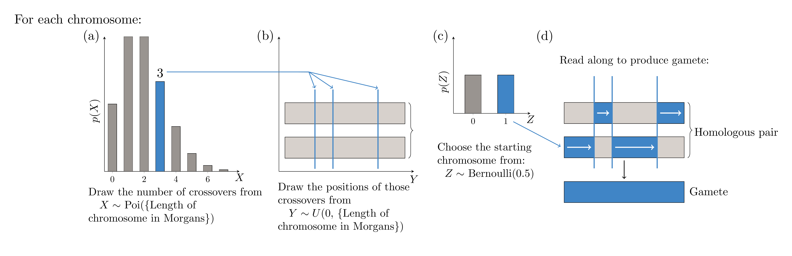

```{r, include = FALSE}
knitr::opts_chunk$set(
  collapse = TRUE,
  comment = "#>"
)
```

```{r setup}
library(genomicSimulation)
```

# Introduction
genomicSimulation is a simple, fast scripting simulation tool for creating 'digital twins' of breeding schemes. The package tracks genotypes at an individual level, and performs stochastic simulation of meiosis (including crossing-over but not mutation) to simulate crossing.

All core functionality is written in C. Performing the computation-intensive tasks at C-level allows for quick runtimes. Because it was initially created for simulating plant breeding programs, the package does not automatically track sex. 

Contact the package maintainers for any feature requests or improvement requests, or to report any bug or crash. 

Guides on using the package can be found in sections 4 and 5 of this vignette.

# Speed
On a consumer-model laptop laptop (Intel(R) Core(TM) i5-7200U CPU @ 2.50GHz, 8GB RAM) running RStudio version 1.2.5019, the process of loading 50 founder lines and 5112 SNPs took on average 0.64 seconds.

A call to `cross.randomly` to generate 100,000 ($10^5$) offspring from those founders took on average 2 seconds to run. Since all crossing functions use the same underlying meiosis simulation and same methodology, this time should be fairly representative of the speed of any crossing function. 

Output (writing to files) adds significant delays. The same command, with save-as-you-go output of GEBVs and pedigrees requested, took approximately 20 seconds to run. With save-as-you-go output of GEBVs, pedigrees, and genotypes (the latter being a significantly larger file size), the function call took approximately 120 seconds. 

Generating the 100,000 offspring, then saving GEBVs, pedigrees, and genotypes to files via separate `save.` functions, took approximately 130 seconds to complete. This is a few seconds longer than the save-as-you-go call that did the same work, possibly because of the time spent moving from R-level execution to C-level and back again.

The C-level functions make no attempt to parallelise execution.

# Package-Specific Details
## Understanding `sim.data`
The package has an internal state where it stores simulated genotypes and other details. The state is stored in a C-level struct called `SimData`. An external pointer to this struct is saved in a package-global R variable called `sim.data$p`. `sim.data$p` is hidden during regular use. 

To reset the simulation/clear it of all data, the function `clear.simdata()` is provided. Currently, functionality to have two concurrent simulation states does not exist.

### Markers
Each `SimData` is given a list of SNPs and a map for positioning these in the genome on creation. These details cannot be changed after creation without clearing the `SimData`. 

The `SimData` object saves names of markers as-is, as long as the name is under 30 characters long. Behaviour is undefined if any marker name is longer than 30 characters (To extend this limit, use the NAME_LENGTH setting (see Global Settings Index)).

Becauses the `SimData` stores its SNPs in genome order, any outputs produced will have the SNP markers ordered according to the genetic map loaded at its creation. If an output method provides genotypes as strings of alleles, the string will also be ordered according ot this genetic map.

### Effects
The simulation calculates breeding values for an arbitrary trait using an additive model and a set of effect values for a given allele at a given marker.

The simulation cannot run without having a genetic map for the SNPs it tracks. However, it can run with no effect values loaded, so there is no need to provide them if GEBVs are not being used.

Only one 'set' of effect values can be loaded at a time.

### Genotypes
Each genotype/line may or may not be allocated a name. If loading names from a file, behaviour is undefined if any line name is longer than 30 characters (To extend this limit, use the NAME_LENGTH setting (see Global Settings Index)).

## Understanding Groups
The SimData deals with genotypes in groups/categories. Automatically, the genotypes loaded from separate files are allocated to separate groups. Each crossing function also places the genotypes it produces in a new group.

A genotype can only belong to one group, so functions that overwrite allocations (eg `make.group`) effectively pull genotypes out of their old group and put them in a new one. This ensures that genotypes can only be deleted once.

Group numbers are natural numbers starting at 1. Group numbers are not guaranteed to be allocated sequentially, because some crossing functions may create and delete temporary groups to carry out their task, so the final group number could be 'out of order'.

Every function except those that pull data into R (functions whose names begin with `see.`) return either one integer or a vector of integers. If the integer is 0, it means the function succeeded but it is not a function that acts on groups. Otherwise, the return value is the group number(s) of the group(s) that were created.

## Understanding Identifiers
There are three categories of identifiers that may be observed during use of the simulation.

1. Group numbers, which were discussed in the section above. They are non-negative integers that define a set of lines. Any number of lines can share a group number, and a line's group number may be changed over the course of the simulation.
1. IDs. These are non-negative integers that are unique to a particular genotype for the lifetime of the `SimData`. IDs are used for tracking pedigree thanks to this uniqueness feature. However, genotypes are not guaranteed to have an ID: genotypes created during crossing with the setting `give.ids` set to FALSE will not be allocated IDs and will have 0 instead. 
1. Indexes. These represent the position/column number in the internal matrix at which the genotype is stored. They are therefore unique to the genotype but not continuous over the lifetime of the `SimData`, because when genotypes/columns are deleted the column numbers of the matrix change. Because, unlike IDs, every genotype is guaranteed to have an index, functions like `make.group` and `cross` that act on particular genotypes generally take indexes as inputs. Since indexes can change, however, it is important to not place a `delete.group` call between getting index data and using indexes in one of these function calls.

## Understanding Output Methods
There are three sets of functions to get output from the simulation. 

- The first involves calling a function to save data to a file (`save.` family functions). 
- The second involves saving the data from a cross as you go (`save.` settings in crossing function parameters). This enables more compact data saving, and also allows for simulating more crosses than can be stored in working memory, by also setting the parameter `retain=FALSE`. In save-as-you-go saving, the simulation generates and saves crosses in batches of 1000 (To change this value, use the CONTIG_WIDTH setting (see Global Settings Index)). save-as-you-go is however less flexible than `save.` family functions because only the default printing format is used and only the genotypes produced by that particular crossing call are saved.
- The third is to use the `see.` family of functions to pull data into R. These are the only functions that break the rule of function return values being either the groups produced by that call or 0 if none are produced. These functions can be used in conjunction with `make.group` as a method of designing custom selection methods. This family of functions is still being expanded.

See the indexes (Section 6 of this vignette) for information on available functions and output formats. 

# Workflow
The assumed workflow for this package involves the following steps:

1. Load progenitor lines and SNP data; save the group number of the progenitor lines. (If using breeding value functions, the effect values for calculating breeding value for a desired trait can be loaded here too). Suggested function: `load.data`
1. Perform crossing from the progenitor group. Keep a hold of the group number of these crosses. Example function: `cross.randomly`
1. Perform selection on the F1 generation generated above. Example function: `select.by.gebv`
1. Perform more crossing from the F1 generation (using the group number from the above step). Example function: `cross.from.top.pc`
1. Repeat for further generations. Example function: `self.n.times`
1. Save the final genotypes (and/or effect values and/or pedigrees) to files. Example function: `save.genotypes`
1. (Optional: Estimate the number of crossovers to reach these final genotypes. Suggested function: `plot.crossovers`)
 Load output files into R for further analysis.

The example below shows a how a typical workflow would save group numbers and call crossing functions.
```{R}
# (Show the tiny example data set)
read.csv("../tests/testthat/helper_genotypes.txt", sep='\t', header=T)
read.csv("../tests/testthat/helper_map.txt", sep='\t', header=T)
read.csv("../tests/testthat/helper_eff.txt", sep='\t')

# Starting to use genomicSimulation: load the small initial data set
g0 <- load.data("../tests/testthat/helper_genotypes.txt",
                "../tests/testthat/helper_map.txt",
                "../tests/testthat/helper_eff.txt")

# Do random crosses from the progenitor lines. 
f1 <- cross.randomly(g0, n.crosses=20, give.names=TRUE, name.prefix="F1.")

#(Let's see what crossovers occured. For this few markers we don't get much information.)
save.pedigrees("a.txt", f1, type="P")
find.plot.crossovers("a.txt", "b.txt")

# Find the 25% with the top breeding value/GEBV
f1.selected <- select.by.gebv(f1, percentage=25)

# Delete groups we are not currently using, to free up some memory.
delete.group(f1)

# Make 40 random crosses from those selected 25%
f2 <- cross.randomly(f1.selected, n.crosses=5)
delete.group(f1.selected)

# Complete 4 rounds of selfing with save-as-you-go genotype saving
f6 <- self.n.times(f2, 4, file.prefix="af6", save.genotype=TRUE)

# Show current state of groups.
see.existing.groups()

# (These are the groups the above command should show)
print(c(g0, f2, f6))

# Show the save-as-you-go output file
read.csv("af6-genotype.txt", sep='\t')


# (cleanup)
file.remove("a.txt")
file.remove("b.txt")
file.remove("af6-genotype.txt")
```

## Writing Custom Selection Methods in R
The only inbuilt selection method in genomicSimulation is `select.by.gebv`. However, custom selection methods can be written in R thanks to the `make.group` function, which takes an arbitrary set of indices and moves them into a new group. Indices of genotypes can be accessed via `see.group.data` with data type parameter `X`, operated on, then passed back to `make.group` to perform selection.

For an example, consider that a user wants to implement a custom selection method wherein they select the top 10 simulated crosses by phenotype. Because genomicSimulation offers no internal method for simulating phenotypes, the user must simulate them in R then use the custom selection method interface to perform their selection.

Suppose the user chooses the following model for their simulated phenotype. The phenotypic values will be made equal to the breeding value plus a draw from a normally distributed distribution with variance equal to $V_e$ (environmental variance), where $V_e$ comes from the equation $H^2 = V_g/(V_g + V_e)$. For the user's purposes, $H^2$ is a known broad-sense heritability estimate and $V_g$ is the variation in breeding values in the set of crosses from which they are selecting. Therefore, the steps to simulate phenotypes are: 
1. calculate the magnitude of $V_e$ using the set of breeding values from the crosses on which selection is being performed
2. draw from a normal distribution to get simulated phenotypes

The user creates the following R function to perform their selection:

```{R}
get.top.10.phenotypes <- function(group, heritability) {
  info <- data.frame(Index=see.group.data(group,"X"),
                     GEBV=see.group.data(group,"BV"))
  
  # simulate phenotype = genotype + environmental variation
  # using normally distributed Ve and heritability H^2 = (Ve + Vg)/Vg
  Vg <- var(info$GEBV)
  Ve <- Vg/heritability - Vg
  info$Pheno <- info$GEBV + rnorm(length(info$GEBV), mean=0, sd = sqrt(Ve))
  
  # Select those with the top phenotype
  return( info[order(info$Pheno, decreasing=TRUE),]$Index[1:10] )

}
```

and uses it via the make.group interface:
```{R}
g0 <- load.data("../tests/testthat/helper_genotypes.txt",
                "../tests/testthat/helper_map.txt",
                "../tests/testthat/helper_eff.txt")

# Simulate crosses
f1 <- cross.randomly(g0, n.crosses=15, offspring=3)
# Apply custom selection method
f1.selected <- make.group(get.top.10.phenotypes(f1, 0.3))
# (delete the non-selected genotypes)
delete.group(f1)

# ... repeat for further generations
f2 <- cross.randomly(f1.selected, n.crosses=100)
f2.selected <- make.group(get.top.10.phenotypes(f2, 0.5))

# ...
delete.group(c(f1.selected,f2,f2.selected))
```


# Details and Methodology

## Methodology: Calculating Breeding Values
The terms 'breeding value' and 'GEBV' are used interchangeably in the package, because the simulation is ignorant of whether real or estimated breeding values were loaded.

The package's internal GEBV calculator uses an additive model of trait effects. The additive effect values loaded from an input file (either via the `load.data` or the `load.different.effects` functions) are stored as a vector for each allele. In calculating breeding values for a genotype, the simulation counts how many copies of each particular allele the genotype has at each SNP, then multiples the vector of counts for a particular allele by the effects for that allele. The final result is the sum of these products across all alleles for which it has a stored effect vector.

{width=100%}


## Methodology: Simulating Meiosis
To create a cross, the simulation generates gametes independently for the two parents. No distinction is made between male and female parent. Simulation of meiosis is also independent between crosses - the second gamete produced by simulation of meiosis is discarded, not saved for later.

For each chromosome number, the number of crossovers to occur in the simulated meiosis are drawn from a Poisson distribution with parameter = [length of the chromosome in Morgans], where length of the chromosome is the distance between the first and last SNP that are in that chromosome according to the linkage map loaded on setup. The positions of those crossovers along the chromosome are then drawn from a uniform distribution, which is why the use of a linkage map (so that distances correspond to likelihood of crossover) is recommended over use of a physical map. Finally, a random logical value (0 or 1) is drawn to choose which of the parent's chromosomes to start with (which of the two gametes produced to use). 

Note that this means that allele order in parents matters, and the simulate genotypes that are produced are phased. <!--Encoded data loaders like `load_transposed_encoded_genes_to_simdata` randomise the order of alleles when the line is heterozygous at a SNP on loading.-->

The R package uses the R random generators, so will follow the R seed.

This procedure is displayed visually in the image below.

<!--{width=100%}
{width=100%}-->

{width=100%}


## Methodology: Counting Recombinations
Extra functionality is available for estimating where crossovers occured in producing certain genotypes. This is offered by the `find.crossovers` and `find.plot.crossovers` functions. The difference between the two is that after crossovers points are found, as well as saving the results matrix to a file `find.plot.crossovers` produces an R plot, as shown below. It assumes the child is mostly homozygous.

{width=100%}

To identify crossovers, the code starts at the beginning of each chromosome for the current child line, and reads through to find SNPs where the parents differ. Here, the provenance of the child's genotype can be determined.

The functions have two parameters that affect the way the crossover counting works: `window.size` and `certainty`.

If the `certainty` setting is `True`, then SNPs where the provenance of an allele cannot be determined are marked with a 0, representing unknown parentage. If the `certainty` setting is `False`, when the provenance of an allele is unknown, the parentage at that SNP is set to the same parent as the most recent SNP with known parentage.

The `window.size` parameter should be an odd positive integer. The window size is the number of SNPs that are observed at a time. Only if the alleles of the child at all SNPs in the window represent a sequence that could have come from one parent, and that same sequence cannot have come from the other, is the parentage at that SNP considered known.

In developing this process it was considered that parent and child lines would be mostly homozygous. 

# Indexes
## Global Settings Index
- NAME_LENGTH (default 30). This parameter is not yet modifiable in the R version
- CONTIG_WIDTH (default 1000). This parameter is not yet modifiable in the R version

## Function Index
Use the R documentation (eg. type `?load.data` in the RStudio console) to get descriptions of these functions.

Loading data:

- `group <- load.data(allele.file, map.file, effect.file = NULL)`
- `group <- load.more.genotypes(allele.file)`
- `load.different.effects(effect.file)`

Simulating crossing:

- `group <- cross(parent1,parent2,[settings])`
- `group <- cross.randomly(group,n.crosses,[settings])`
- `group <- cross.combinations(first.parents,second.parents,[settings])`
- `group <- cross.combinations.file(cross.file,[settings])`
- `group <- cross.dc.combinations.file(cross.file,[settings])`
- `group <- cross.all.pairs(group,[settings])`
- `group <- self.n.times(group,n,[settings])`
- `group <- make.doubled.haploids(group,[settings])`

Performing selection:

- `selected.group <- select.by.gebv(from.group, low.score.best = FALSE, percentage OR number)`
- For more customised selection, use the process
  - `info <- data.frame("i" = see.group.data(from.group,"X"), "Data"=see.group.data(from.group,...))`
  - `selected.info <- `[some R manipulation on `info` that discards rows not selected under the custom selection]
  - `selected.group <- make.group(selected.info$i)`

Modify groupings:

- `delete.group(groups)`
- `group <- combine.groups(groups)`
- `group <- make.group(indexes)`
- `[vector of groups] <- break.group.into.individuals(group)`
- `[vector of groups] <- break.group.into.families(group)`
- `[vector of groups] <- break.group.into.halfsib.families(group)`
- `[vector of groups] <- break.group.evenly(group, into.n = 2)`
- `[vector of groups] <- break.group.into.buckets(group, [vector of buckets])`
- `[vector of groups] <- break.group.randomly(group, into.n = 2)`
- `[vector of groups] <- break.group.with.probabilities(group, [vector of probabilities])`

Save data (saves results to files):

- `save.genome.model(filename)`
- `save.genotypes(filename, group = NULL, type = "R")`
- `save.allele.counts(filename, group = NULL, allele)`
- `save.pedigrees(filename, group = NULL, type = "R")`
- `save.GEBVs(filename, group = NULL)`
- `save.local.GEBVs.by.chr(filename, n.blocks.per.chr, group = NULL)`
- `save.local.GEBVs.by.file(filename, block.file, group = NULL)`

View data (pulls data into R dataframes):

- `[dataframe containing current existing groups and their sizes] <- see.existing.groups()`
- `[vector containing the chosen data] <- see.group.data(group, data.type)`
- `[string containing best allele per SNP] <- see.optimal.haplotype()`
- `[float: the maximum possible GEBV] <- see.optimal.GEBV()`
- `[float: the minimum possible GEBV] <- see.minimum.GEBV()`

Identify recombination events:

- `find.crossovers(parentage.file, out.file, window.size = 1, certainty = TRUE)`
- `find.plot.crossovers(parentage.file, out.file, window.size = 1, certainty = TRUE)`

Data Storage:

- `clear.simdata()`

## Crossing Function Settings
All crossing functions take in a common set of settings. These are briefly described below.

- `offspring` : A setting representing the number of times to do each cross.
- `retain` : A boolean, repesenting whether to save the generated genotypes to memory or discard them. You may wish to discard them but save to file if you are generating too many crosses to save into memory.
- `give.names` : A boolean representing whether or not to produce names for the new genotypes generated. The names produced would have format [name.prefix][id]
- `name.prefix` : A string. If give.names is TRUE, the id is concatenated to this to produce the name of each new genotype.
- `track.pedigree` :A boolean representing whether or not to save the ids of the parents of each new genotype to the new genotype's pedigree. If this is false, the new genotype's pedigree is unknown.
- `give.ids` : A boolean representing whether or not to allocate each new genotype an id. If this is FALSE, the new genotype is 'invisible' to pedigree trackers and even if the pedigree of its offspring is supposedly tracked, the pedigree trackers will not be able to identify the progenitors of its offspring. Furthermore, if it is false and names are generated using give.names, all names generated in the same group will be the same. Probably you'd only have this FALSE if you were discarding the results or worried about id overflow.
- `file.prefix` : A string representing the prefix of files produced if save.pedigree=TRUE, save.gebv=TRUE, or save.genotype=TRUE.
- `save.pedigree` : A boolean. If TRUE, saves the pedigree in recursive format of each generated genotype to the text file with filename "[file.prefix]-pedigree".
- `save.gebv` : A boolean. If TRUE, saves the GEBVs of each generated genotype to the tab-separated text file with filename "[file.prefix]-eff".
- `save.genotype` : A boolean. If TRUE, saves the SNP/line matrix in regular format (generated genotypes as rows, SNPs as columns) to the tab-separated text file with filename "[file.prefix]-genome".


## Input File Formats
### Founder genotypes and SNPs
The basic file format expected to the `allele.file` parameter of `load.data` is:
```
name	G01	G02	G03	G04	G05	G06
m1	TT	TT	TT	TA	TT	AT
m3	TT	TT	TA	TA	TT	TT
m2	AA	AA	AA	AA	TT	AA
```
where G01, G02, ..., are the parent lines and m1, m2 and m3 are the SNPs. Cells may be space-separated or tab-separated. The value in the first cell ("name" in this example) is ignored.

To load more genotypes after original creation of the `SimData`, use the function `group <- load.more.genotypes(allele.file)`


### Linkage maps

The function's parameter `map.file` requires a file format like the following:
```
marker chr pos
m3 3 15
m2 1 8.3
m1 1 5.2
```
The first line's values are not checked. After that, it requires that all rows have three tab-separated values. The first should be the marker name, the second an integer representing the chromosome number, and the third a decimal representing the position of the SNP along the chromosome in centiMorgans (cM). 

This function loads only markers that already appear in the `SimData`'s SNP list, which is created from the SNPs in the genotype matrix file (`allele.file`). It will print out how many markers it successfully loaded.


### Effect files
Loading an effect file is optional for running the simulation. Its format should be:
```
m1 A -0.8
m2 A -0.1
m3 A 0.1
m1 T 0.9
m3 T -0.1
m2 T -0.5
```

The first column should be a SNP marker name, the second should be the allele this effect value corresponds to (as a single character), and then a decimal representing the effect value of that allele for that SNP.

A particular SNP/allele combination not being included in the file is equivalent to that combination having an effect value of 0. If a particular SNP/allele combination is included multiple times in a file, only the last occurence is saved.

### Combination crossing functions
Two crossing functions (`cross.combinations.file` and `cross.dc.combinations.file`) take instructions from files.

- `cross.combinations.file` : Take a file containing tab-separated pairs of line names and perform those crosses. An example file looks like:
```
G01	G02
G01	G03
G05	G06
G01	G04
```
- `cross.dc.combinations.file` : Supposes that only the names of the precursor lines are known but specific crosses between F1 individuals are wanted. Assumes that those F1 individuals have been produced with id allocation/pedigree tracking turned on. The function therefore reads in a tab-separated file that looks like the below to perform the cross between the offspring of G01 and G02, and the offspring of G03 and G05, and so forth.
```
G01	G02	G03	G05
G01	G03	G05	G06
G05	G06	G01	G04
```


## Output File Formats
### Saving genotypes
Use the function `save.genotypes` or the `save.genotype = TRUE` setting of crossing functions to save the alleles of generated genotypes across the list of SNPs.

It will save genotypes in the following format:
```
	m1	m2	m3
F107	TT	AA	TT
F108	TT	AA	TT
F109	TA	AA	TT
```

Note that this is the transpose of the usual expected input file format. Due to the linked list method used to store genotypes, it will be slower/take more passes over the data to print the transposed equivalent. However, this alternate format (shown below) is available via `save.genotypes` with `type = "T"`.
```
   F107   F108   F109
m1 TT     TT     TA
m2 AA     AA     AA
m3 TT     TT     TT
```

### Saving pedigrees
Pedigrees can be saved in one of two ways:

- `save.pedigrees`, with `type = "P"`, which saves in the following format, even if grandparents are known:
```
F2010   F107   F107
F2011   F108   F109
```
This is a tab-separated text file. The first column is the child name, and the next two columns are the names of its immediate parents (or single parent duplicated if it was produced by selfing or doubling haploids). If names are not available, IDs are used instead.

- `save.pedigrees`, with `type = "R"`, or crossing with setting `save.pedigree = TRUE`, which save in the following format:
```
10	F2010=(F107(G01,G02))
11	F2011=(F108(G01,G03),F109(G02,G03))
```
The function is recursive and will continue to track back to find parents until it reaches a genotype with unknown parentage. If, before it reaches a genotype with unknown parentage, it finds one with a parent that does not exist anymore (that has been deleted), it treats that genotype as having unknown parentage and also prints a warning to the user warning that they may have prematurely deleted some genotypes. Users who did intend to perform that deletion and wish to avoid this warning should turn ID allocation off when generating those to-be-deleted genotypes.

Note that in the example above, F2010 is produced by selfing or doubling a haploid of F107, while F2011 is a cross.

### Saving breeding values
Saving GEBVs, either via the `save.GEBVs` function or the `save.gebv = TRUE` setting of crossing functions, produces an output with the following format:
```
1	G01	1.400000
2	G02	1.400000
3	G03	1.600000
```
This is a tab-separated text file. The first column is the ID, then the name of each line, then the GEBV of that line.

### Saving block effect values/local GEBVs
The effect values for each parental half of a genotype's alleles and summed up for markers in a particular block (defined in the `block.file` parameter) can be saved to a file via the `save.local.GEBVs` function.

A block file with format the following format should be the second parameter:
```
Chrom	Pos	Name	Class	Markers
1	2.3	b000000	b	m1;m2;m3;
2 1.5 b000001 b m4;
...
```

The chromosome number, position and class columns are ignored. Any number of markers can be semicolon-separated in the last column. 

The output file has format:
```
    G1  G2  G3  G4 ...
b000000_1   0.25    0.25    -0.45   -0.45 ...
b000000_2   0.25    0.20    0.05    0.20 ...
b000001_1 ...
b000001_2 ...
```
This is a tab-separated text file.

### Save a summary of the `SimData`
The function `save.genome.model` is available to print out the map and effect values that the current `SimData` is using. The format in which it prints them is:
```
name	chr	pos	A	T
m1	1	5.200000	-0.800000	0.900000
m2	1	8.300000	-0.100000	-0.500000
m3	3	15.000000	0.100000	-0.100000
```
This is a tab-separated text file. 

### Recombination counters
The matrix saved to a file will have a format like the following:
```
	m1	m2	m3
F07	0	1	0
F08	0	2	0
F09	0	2	0
F10	0	1	0
```
A 0 refers to an unknown parentage. Non-zero values are the ID of the parent from which the allele was inherited. 


## R Output Formats

### `see.existing.groups`
This function returns a dataframe with two columns:

- `Group`, containing the group numbers of all existing groups
- `GroupSize`, containing the number of genotypes currently allocated to that group number.

### `see.group.data`
This function returns a vector containing the values of the chosen data type for each group member. The parameter `data.type` is case-insensitive and matched to the beginning of the string, so `data.type="N"` and `data.type="names"` both will return data of type 'N'.

Available data types: Description (`data.type` parameter value)

- Names (N)
- IDs (D)
- Indexes (X)
- Genotypes (G)
- GEBVs/breeding values (B)
- Name of the first parent, or the first parent's ID if it has no name (P1)
- Name of the second parent, or the second parent's ID if it has no name (P2)
- Full/recursive known pedigree, as a string (PED)


